# Sequence Diagrams

This document is derived from the `@chenhw7/dsh-memory` source code and covers all core workflows. It serves two purposes:

- **User introduction**: quickly understand how the plugin operates
- **Code analysis & improvement**: locate call chains, identify coupling points, evaluate optimization opportunities

---

## 1. Module Initialization & Service Composition

The plugin declares 6 bundle rows in `cordis.patch.yml`, loaded in dependency order. `storageDomain` is the injection source for all modules.

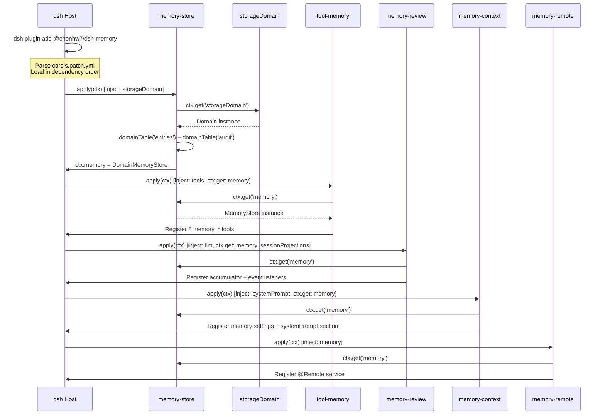

---

## 2. Model-Initiated Write — `memory_add` Tool Call

The model writes memories via tool calls. Both the tool layer and the store layer execute `scanContent`, forming defense in depth.

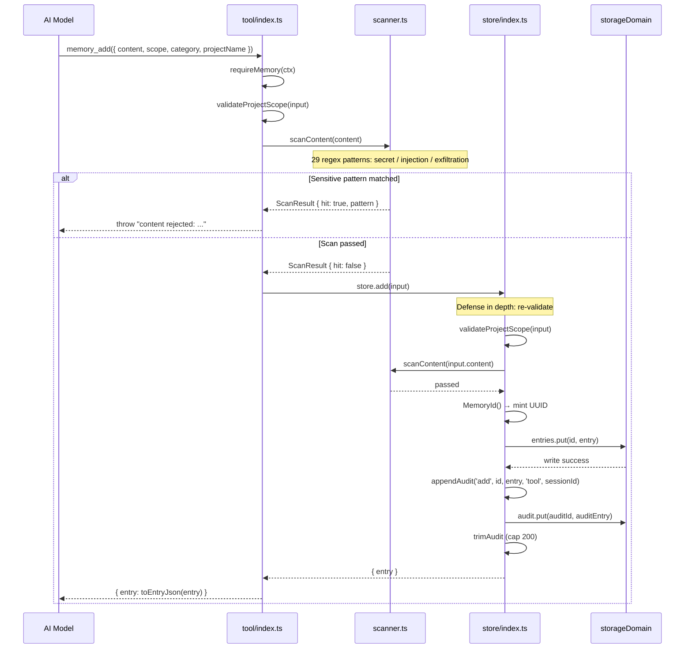

---

## 3. Model-Initiated Search — `memory_search` Tool Call

The model searches existing memories, with keyword tokenization matching (including CJK per-character tokenization).

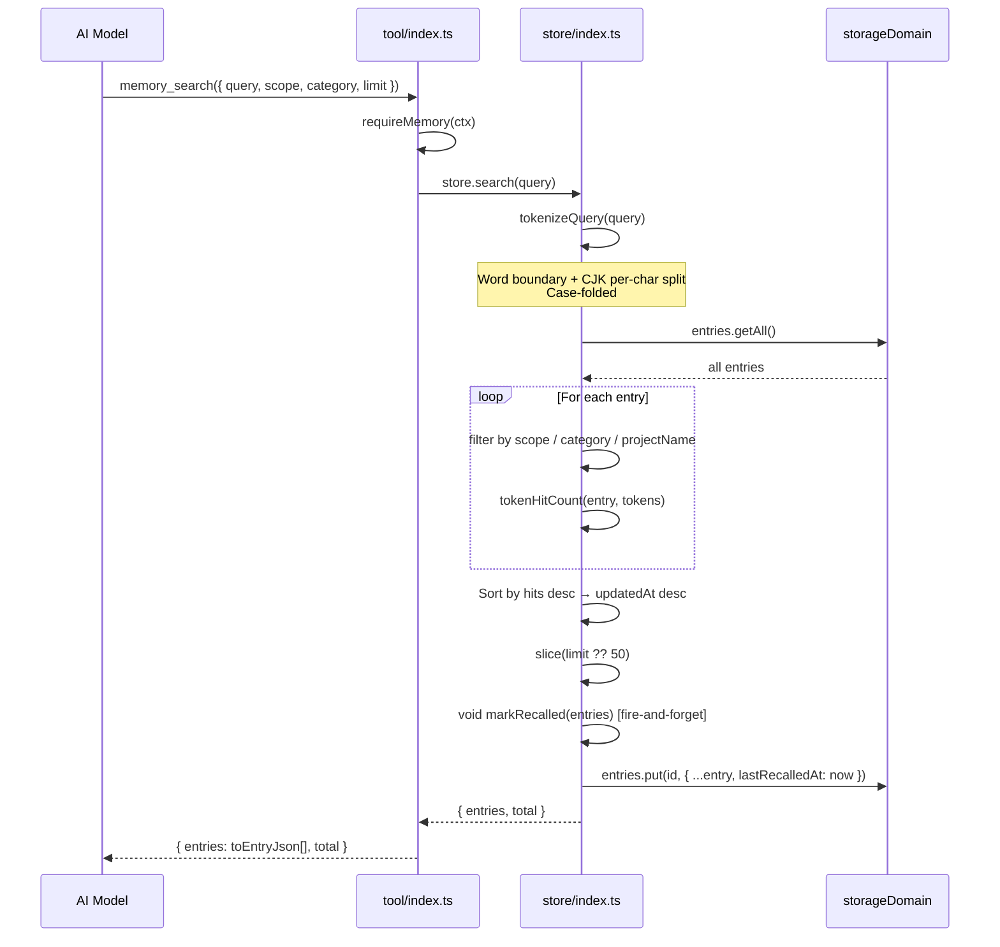

---

## 4. Automatic Learning — Periodic Review Extraction

Core workflow: accumulate session events → reach threshold → trigger LLM extraction → parse → scan → dedup → store.

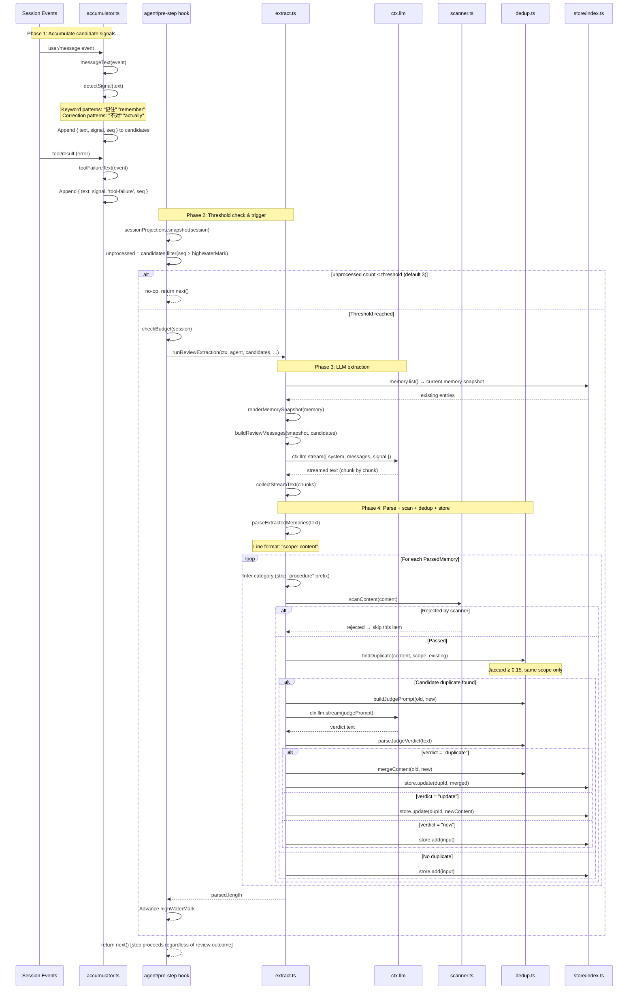

---

## 5. Compaction Flush

When context is compacted, memories are extracted from fragments about to be lost. Fire-and-forget — never blocks compaction.

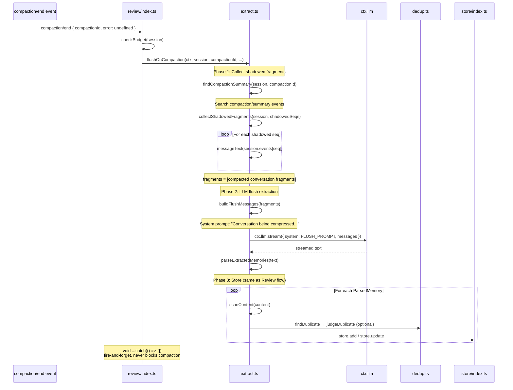

---

## 6. Session Dispose Flush

When a session is disposed, memories are extracted from the full conversation. 5-second timeout limit.

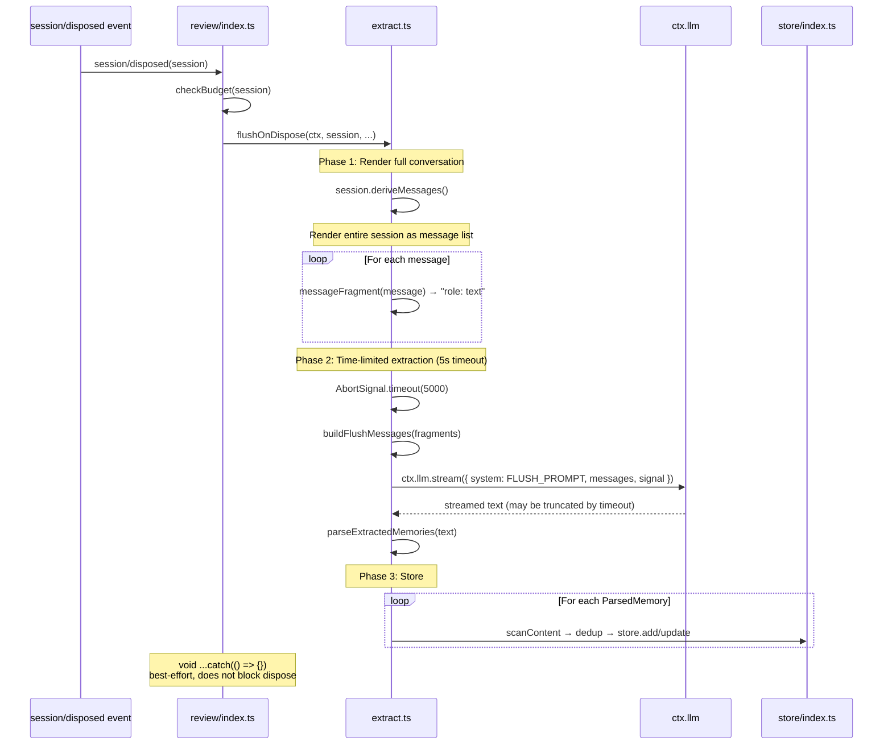

---

## 7. Janitor Decay

Triggered on new session creation, decays stale project-scoped memories that haven't been recalled. Global and user-scoped memories are never decayed.

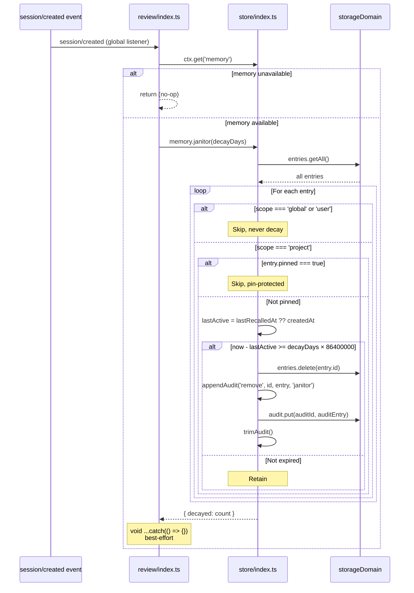

---

## 8. System-Prompt Context Injection

A memory snapshot is frozen at session creation; each step's prompt assembly reads live settings + the frozen snapshot to compose the prompt section.

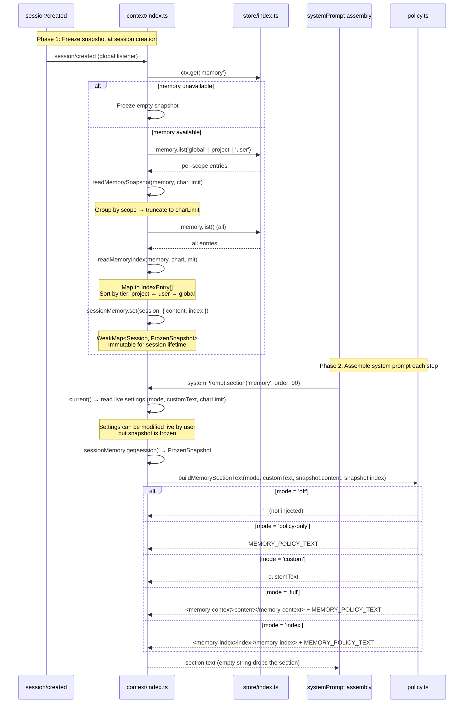

---

## 9. Frontend UI Remote Interaction

The browser calls `@Remote` services via the Typert protocol to manage memory data.

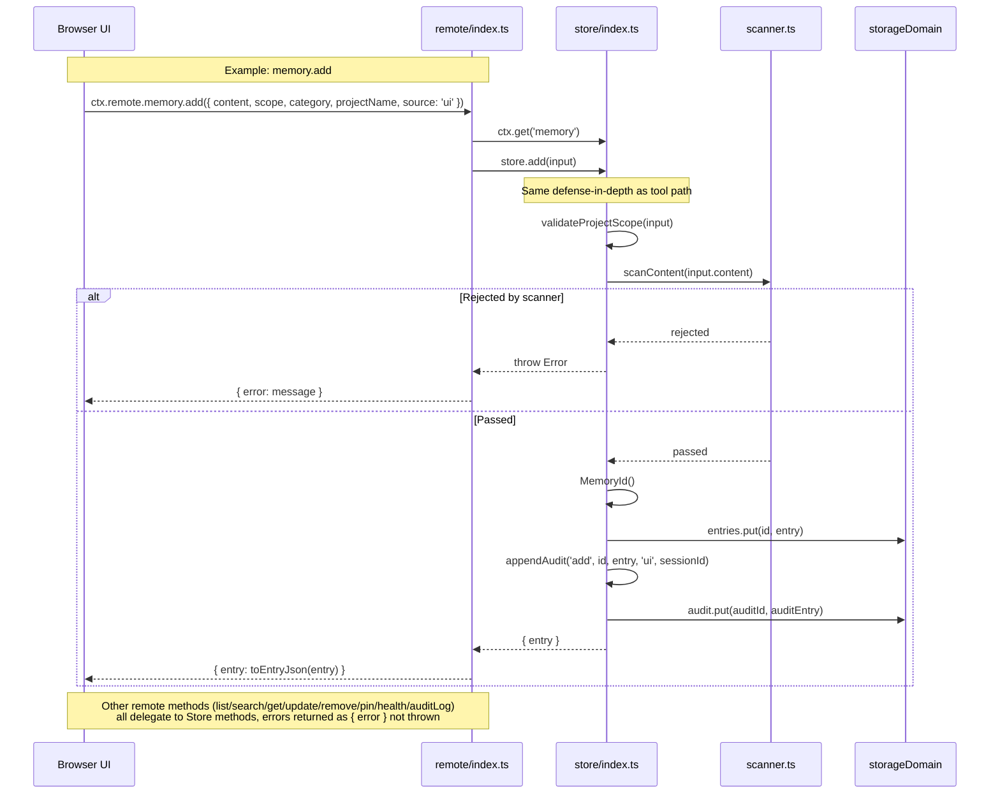

---

## 10. Client Settings UI

The browser registers a settings card; users modify configuration live, taking effect on the next system-prompt assembly.

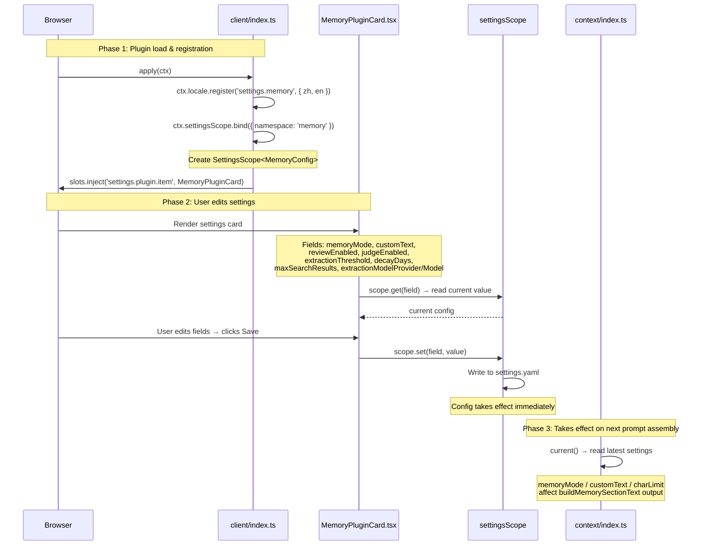

---

## Appendix: Module Dependencies & Service Call Graph

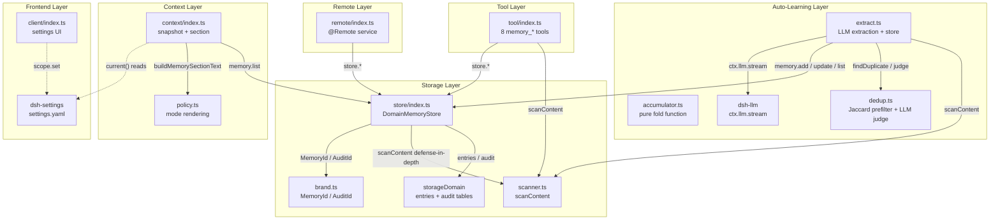

---

## Key Design Observations (for Code Analysis & Improvement)

| Observation | Description | Potential Improvement |
|-------------|-------------|----------------------|
| **Double scan** | `scanContent` runs at both tool layer and store layer | Performance: could cache or mark already-scanned items to avoid redundant work |
| **Fire-and-forget** | Review/Flush/Janitor all use `void ...catch(() => {})` | Observability: silent failures are hard to debug; could add logging/reporting |
| **Snapshot freeze timing** | Frozen at `session/created`; setting changes don't update current session | Consistency: user must start a new session for changes to take effect; consider a version-tag mechanism |
| **Dedup Jaccard threshold** | Hardcoded at 0.15, same scope only | Configurability: threshold could be exposed as a setting |
| **Extraction budget** | `extractionCalls` per-session WeakMap, no global limit | Protection: concurrent sessions may exceed expected LLM call volume |
| **Janitor project-only** | global / user never decay; only triggered on `session/created` | Frequency: fires on every new session, may scan too often in high-churn scenarios |
| **Audit log cap** | `trimAudit` hardcoded at 200 entries | Configurability: could be exposed as a setting |
| **Conflict detection not wired** | `context/conflict.ts` is implemented but not used in any workflow | Integration: could run conflict detection after review extraction to alert users of contradictory memories |
