# 时序图 (Sequence Diagrams)

本文档基于 `@chenhw7/dsh-memory` 源码绘制，覆盖所有核心工作流，用于：

- **向用户介绍**：快速理解插件的运行机制
- **代码分析改进**：定位调用链、发现耦合点、评估优化方向

---

## 1. 模块初始化与服务组装

插件通过 `cordis.patch.yml` 声明 6 个 bundle row，按依赖顺序加载。`storageDomain` 是所有模块的注入源。

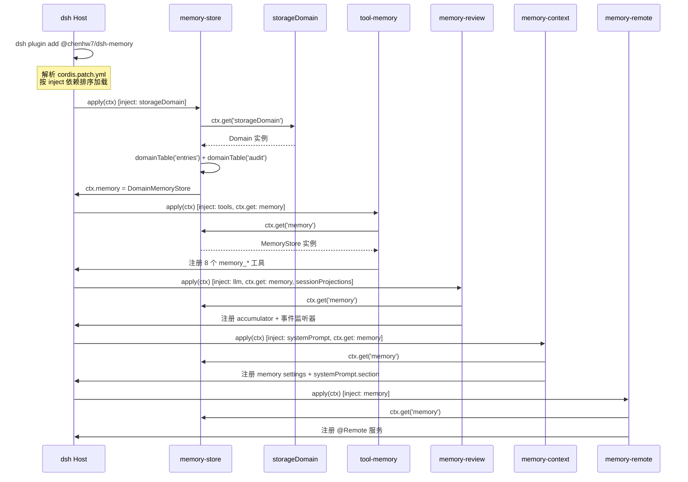

---

## 2. 模型主动写入 — `memory_add` 工具调用

模型通过工具调用写入记忆。工具层与存储层都执行 `scanContent`，形成纵深防御。

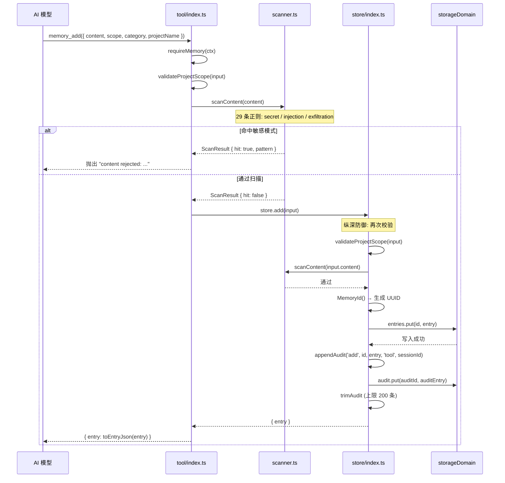

---

## 3. 模型主动搜索 — `memory_search` 工具调用

模型搜索已有记忆，支持关键词分词匹配（含 CJK 逐字分词）。

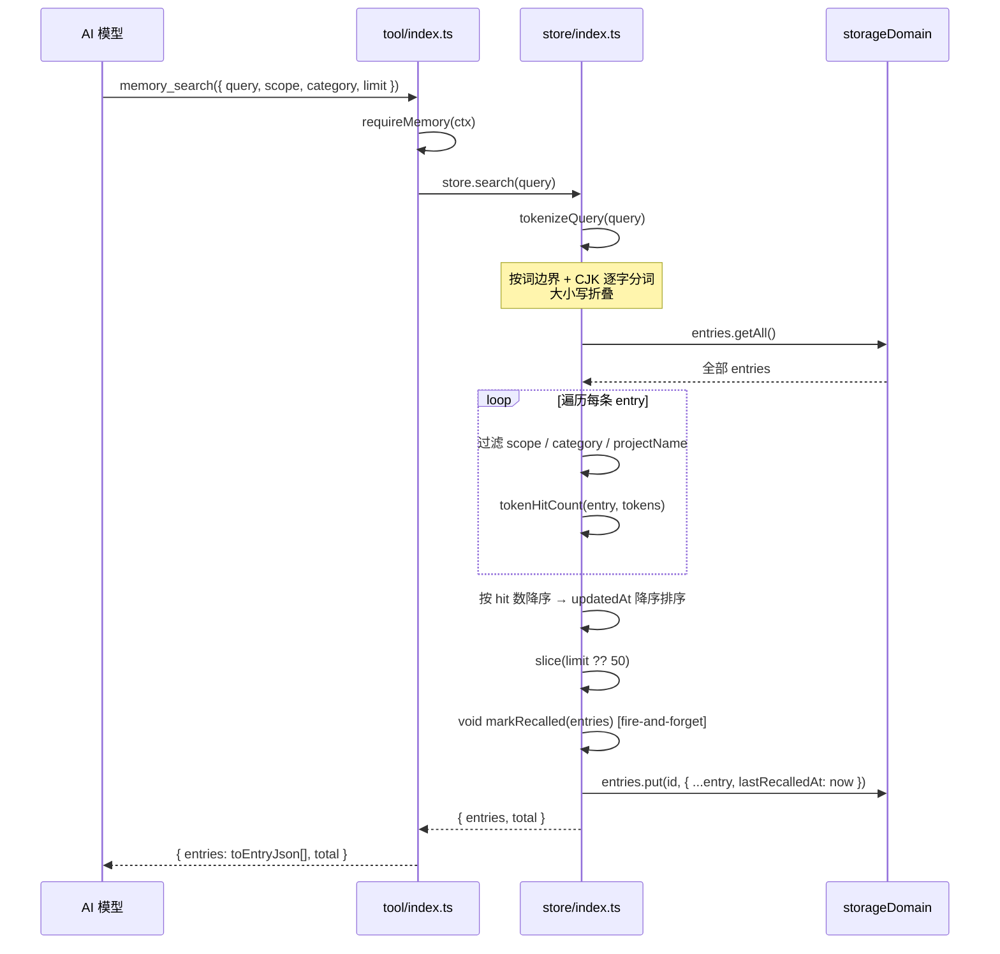

---

## 4. 自动学习 — 周期性审查提取 (Periodic Review)

核心工作流：会话事件累加 → 达到阈值触发 LLM 提取 → 解析 → 扫描 → 去重 → 存储。

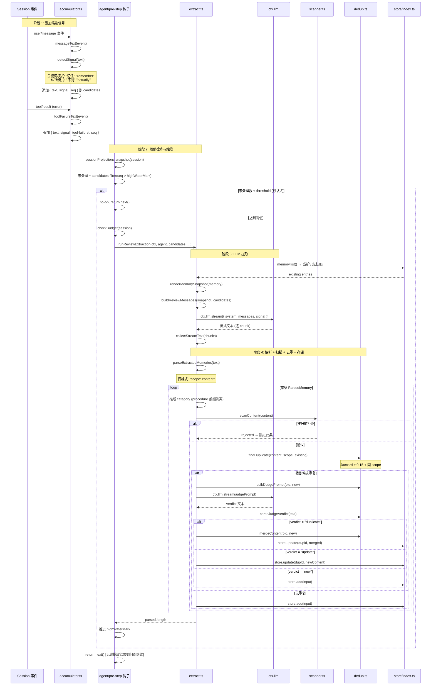

---

## 5. 上下文压缩刷出 (Compaction Flush)

当上下文被压缩时，从即将丢失的片段中提取记忆。Fire-and-forget，不阻塞压缩。

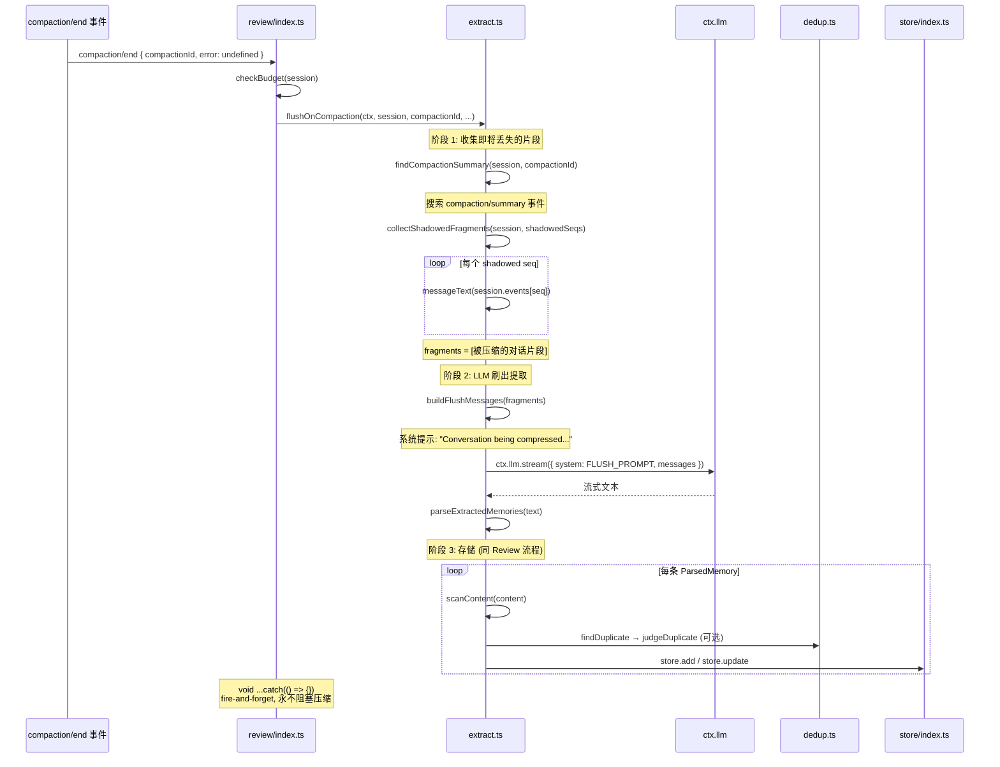

---

## 6. 会话销毁刷出 (Session Dispose Flush)

会话被销毁时，从完整对话中提取记忆。5 秒超时限制。

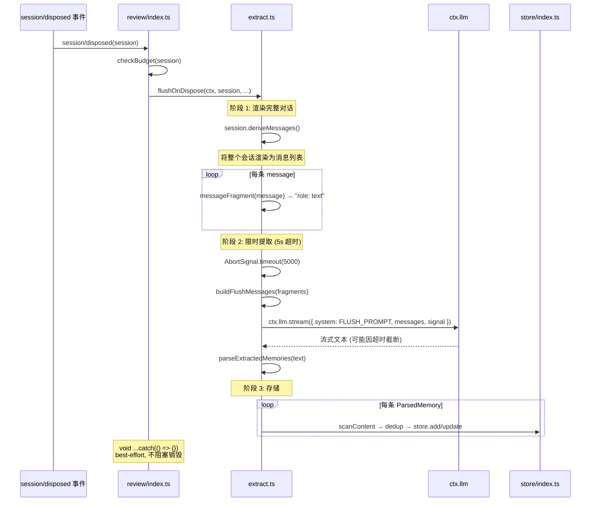

---

## 7. 清理者衰减 (Janitor Decay)

新会话创建时触发，清理长期未被召回的 project 级记忆。全局和用户级记忆永不被衰减。

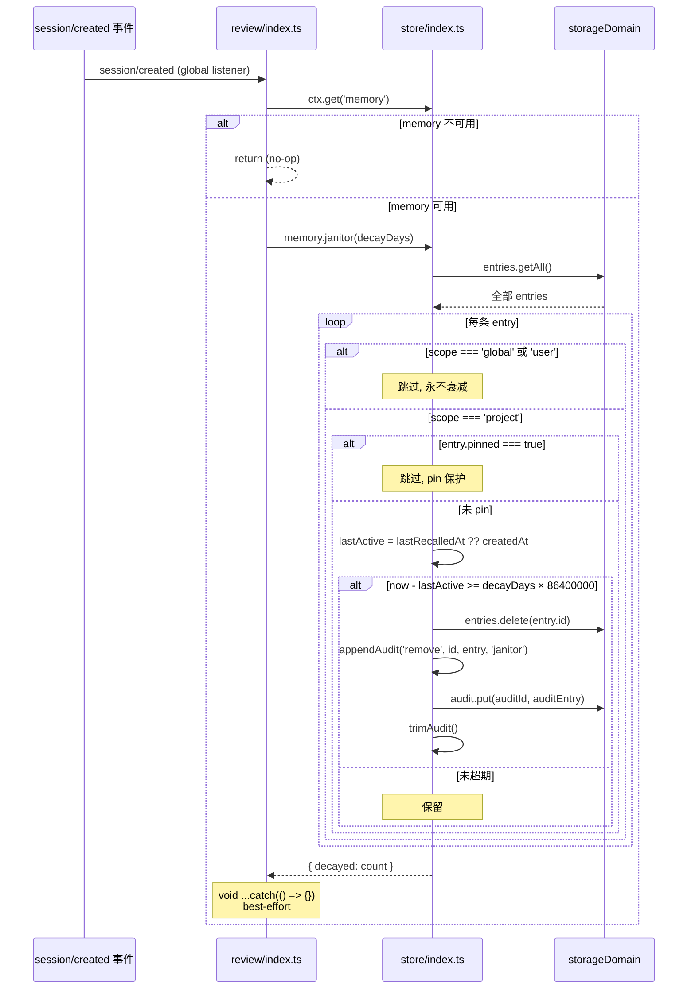

---

## 8. 系统提示注入 (System-Prompt Context Injection)

在会话创建时冻结记忆快照，每步组装系统提示时读取实时设置 + 冻结快照，拼接为 prompt section。

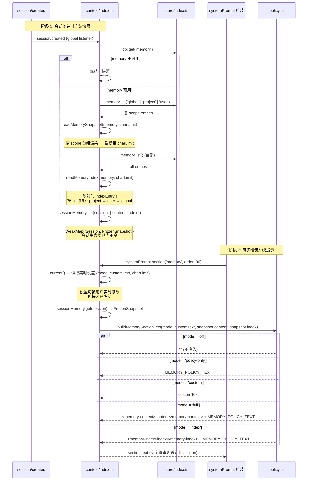

---

## 9. 前端 UI 远程交互 (Remote UI Interaction)

浏览器端通过 Typert 协议调用 `@Remote` 服务，操作记忆数据。

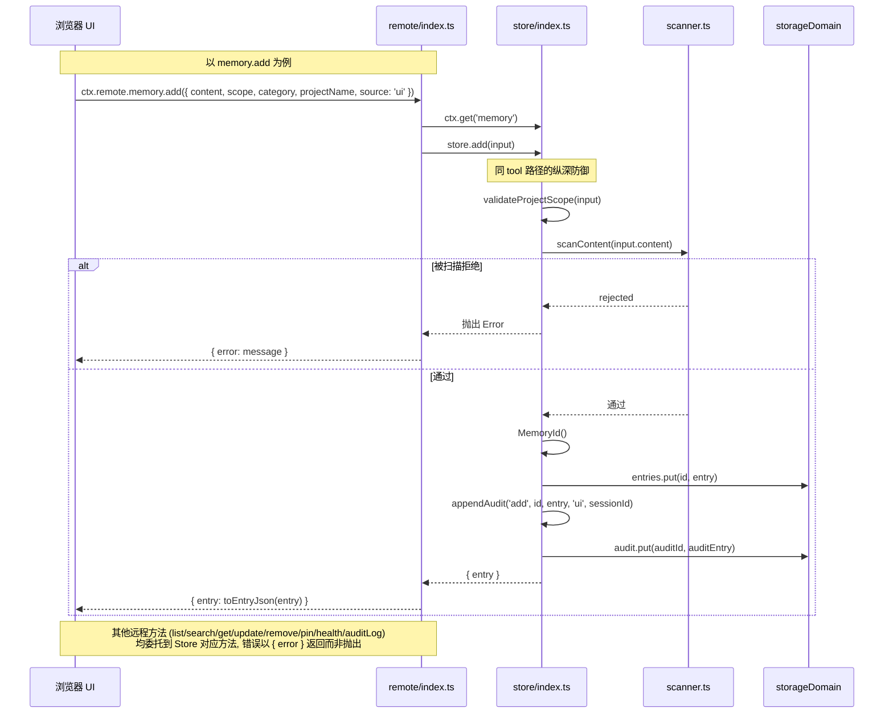

---

## 10. 前端设置 UI (Client Settings)

浏览器端注册设置卡片，用户实时修改配置，下次系统提示组装时生效。

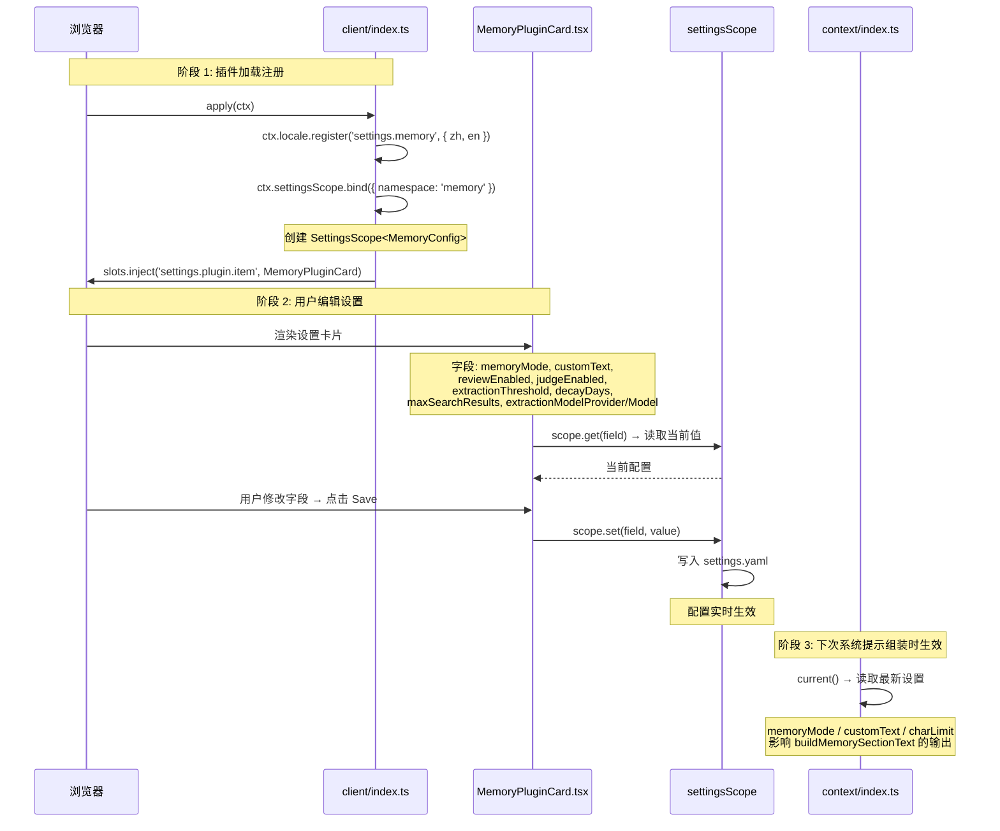

---

## 附录: 模块依赖与服务调用关系

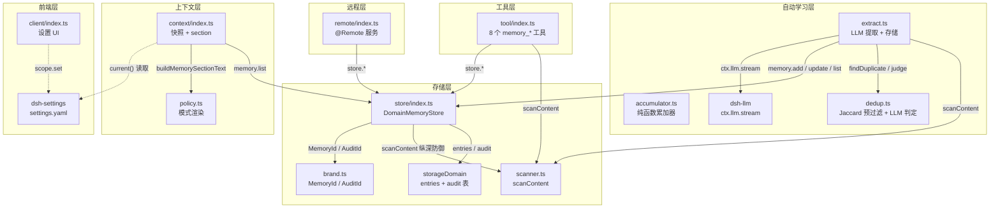

---

## 关键设计观察 (用于代码分析改进)

| 观察点 | 说明 | 潜在改进方向 |
|--------|------|-------------|
| **双层扫描** | `scanContent` 在 tool 层和 store 层各执行一次 | 性能：可加缓存或标记已扫描条目避免重复 |
| **Fire-and-forget** | Review/Flush/Janitor 均用 `void ...catch(() => {})` | 可观测性：静默失败难以排查，可增加日志上报 |
| **快照冻结时机** | `session/created` 时冻结，设置修改后本会话不更新 | 一致性：用户修改设置需新会话才生效，可考虑版本号机制 |
| **Dedup Jaccard 阈值** | 硬编码 0.15，同 scope 才比较 | 可配置化：阈值可作为设置项暴露 |
| **提取预算** | `extractionCalls` per-session WeakMap，无全局限制 | 防护：多会话并发时可能超出预期 LLM 调用量 |
| **Janitor 仅 project 级** | global / user 永不衰减，仅 `session/created` 触发 | 频率：新会话创建即触发，高频会话场景可能频繁扫描 |
| **审计日志上限** | `trimAudit` 硬编码 200 条 | 可配置化：可暴露为设置项 |
| **冲突检测未接入** | `context/conflict.ts` 已实现但未在任何工作流中使用 | 可接入：在 review 提取后运行冲突检测，向用户提示矛盾记忆 |
