# 时序图 (Sequence Diagrams)

本文档基于 `@chenhw7/dsh-memory` v0.5.0 源码绘制（v0.3 核心 + v0.4 管理 UI + v0.5 P0/P1 治理），覆盖所有核心工作流，用于：

- **向用户介绍**：快速理解插件的运行机制
- **代码分析改进**：定位调用链、发现耦合点、评估优化方向

---

## 1. 模块初始化与服务组装

插件通过 `cordis.patch.yml` 声明 7 个 bundle row。行顺序不承载加载语义；下图箭头表示依赖方向。

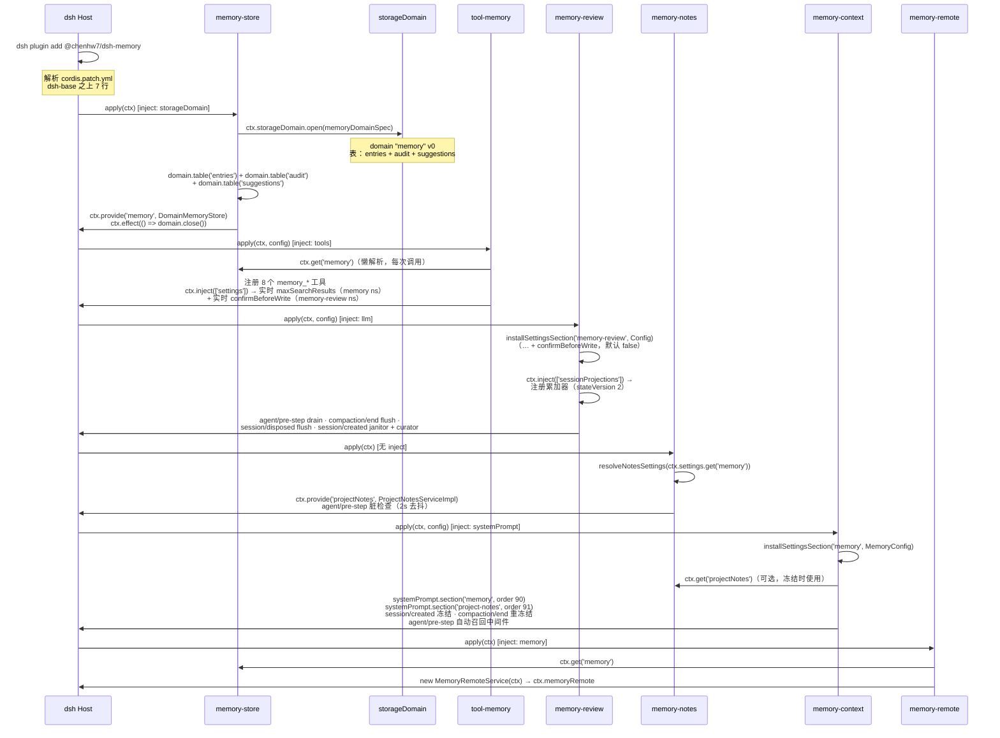
```mermaid
sequenceDiagram
    participant Host as dsh Host
    participant Store as memory-store
    participant SD as storageDomain
    participant Tool as tool-memory
    participant Review as memory-review
    participant Notes as memory-notes
    participant Context as memory-context
    participant Remote as memory-remote

    Host->>Host: dsh plugin add @chenhw7/dsh-memory
    Note over Host: 解析 cordis.patch.yml<br/>dsh-base 之上 7 行

    Host->>Store: apply(ctx) [inject: storageDomain]
    Store->>SD: ctx.storageDomain.open(memoryDomainSpec)
    Note over SD: domain "memory" v0<br/>表：entries + audit + suggestions
    Store->>Store: domain.table('entries') + domain.table('audit')<br/>+ domain.table('suggestions')
    Store->>Host: ctx.provide('memory', DomainMemoryStore)<br/>ctx.effect(() => domain.close())

    Host->>Tool: apply(ctx, config) [inject: tools]
    Tool->>Store: ctx.get('memory')（懒解析，每次调用）
    Tool->>Host: 注册 8 个 memory_* 工具<br/>ctx.inject(['settings']) → 实时 maxSearchResults（memory ns）<br/>+ 实时 confirmBeforeWrite（memory-review ns）

    Host->>Review: apply(ctx, config) [inject: llm]
    Review->>Review: installSettingsSection('memory-review', Config)<br/>（… + confirmBeforeWrite，默认 false）
    Review->>Review: ctx.inject(['sessionProjections']) →<br/>注册累加器（stateVersion 2）
    Review->>Host: agent/pre-step drain · compaction/end flush ·<br/>session/disposed flush · session/created janitor + curator

    Host->>Notes: apply(ctx) [无 inject]
    Notes->>Notes: resolveNotesSettings(ctx.settings.get('memory'))
    Notes->>Host: ctx.provide('projectNotes', ProjectNotesServiceImpl)<br/>agent/pre-step 脏检查（2s 去抖）

    Host->>Context: apply(ctx, config) [inject: systemPrompt]
    Context->>Context: installSettingsSection('memory', MemoryConfig)
    Context->>Notes: ctx.get('projectNotes')（可选，冻结时使用）
    Context->>Host: systemPrompt.section('memory', order 90)<br/>systemPrompt.section('project-notes', order 91)<br/>session/created 冻结 · compaction/end 重冻结<br/>agent/pre-step 自动召回中间件

    Host->>Remote: apply(ctx) [inject: memory]
    Remote->>Store: ctx.get('memory')
    Remote->>Host: new MemoryRemoteService(ctx) → ctx.memoryRemote
```

---

## 2. 模型发起的写入 — `memory_add` 工具调用

模型经工具调用写入记忆。校验与扫描在工具层与 store 层各执行一次——纵深防御。

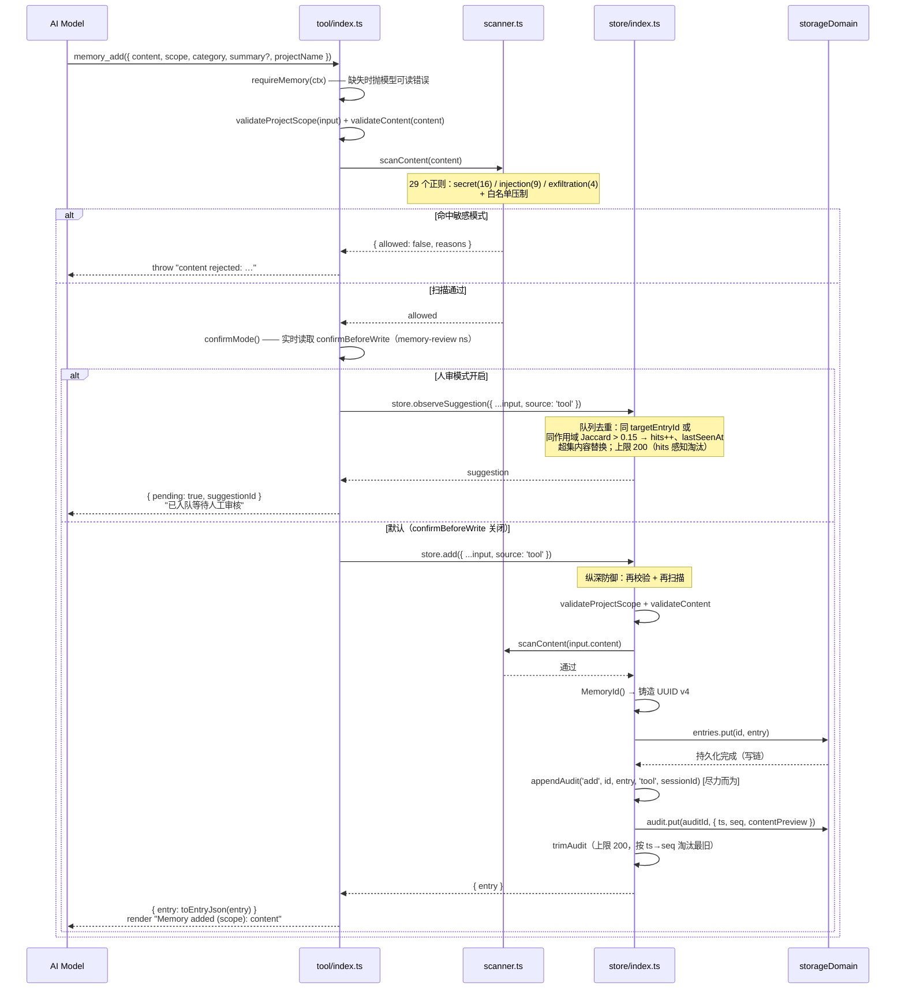
```mermaid
sequenceDiagram
    participant Model as AI Model
    participant Tool as tool/index.ts
    participant Scanner as scanner.ts
    participant Store as store/index.ts
    participant SD as storageDomain

    Model->>Tool: memory_add({ content, scope, category, summary?, projectName })
    Tool->>Tool: requireMemory(ctx) —— 缺失时抛模型可读错误
    Tool->>Tool: validateProjectScope(input) + validateContent(content)

    Tool->>Scanner: scanContent(content)
    Note over Scanner: 29 个正则：secret(16) / injection(9) / exfiltration(4)<br/>+ 白名单压制
    alt 命中敏感模式
        Scanner-->>Tool: { allowed: false, reasons }
        Tool-->>Model: throw "content rejected: …"
    else 扫描通过
        Scanner-->>Tool: allowed
        Tool->>Tool: confirmMode() —— 实时读取 confirmBeforeWrite（memory-review ns）
        alt 人审模式开启
            Tool->>Store: store.observeSuggestion({ ...input, source: 'tool' })
            Note over Store: 队列去重：同 targetEntryId 或<br/>同作用域 Jaccard > 0.15 → hits++、lastSeenAt<br/>超集内容替换；上限 200（hits 感知淘汰）
            Store-->>Tool: suggestion
            Tool-->>Model: { pending: true, suggestionId }<br/>"已入队等待人工审核"
        else 默认（confirmBeforeWrite 关闭）
            Tool->>Store: store.add({ ...input, source: 'tool' })

            Note over Store: 纵深防御：再校验 + 再扫描
            Store->>Store: validateProjectScope + validateContent
            Store->>Scanner: scanContent(input.content)
            Scanner-->>Store: 通过

            Store->>Store: MemoryId() → 铸造 UUID v4
            Store->>SD: entries.put(id, entry)
            SD-->>Store: 持久化完成（写链）

            Store->>Store: appendAudit('add', id, entry, 'tool', sessionId) [尽力而为]
            Store->>SD: audit.put(auditId, { ts, seq, contentPreview })
            Store->>Store: trimAudit（上限 200，按 ts→seq 淘汰最旧）

            Store-->>Tool: { entry }
            Tool-->>Model: { entry: toEntryJson(entry) }<br/>render "Memory added (scope): content"
        end
    end
```

---

## 3. 模型发起的检索 — `memory_search` 工具调用

先做结构化过滤，再做 CJK 感知分词的 BM25 相关性排序。

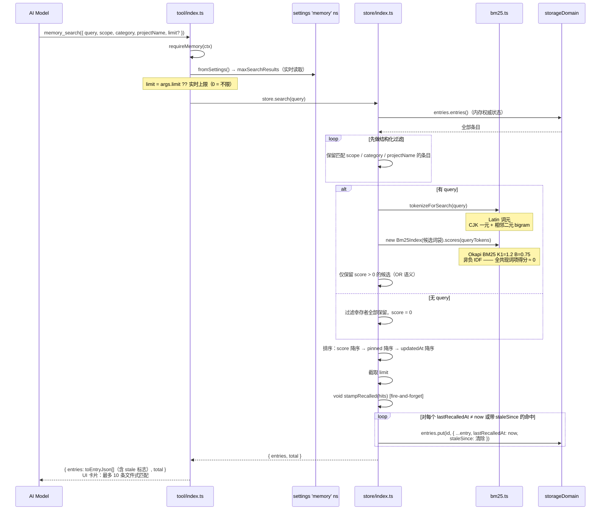
```mermaid
sequenceDiagram
    participant Model as AI Model
    participant Tool as tool/index.ts
    participant Settings as settings 'memory' ns
    participant Store as store/index.ts
    participant BM25 as bm25.ts
    participant SD as storageDomain

    Model->>Tool: memory_search({ query, scope, category, projectName, limit? })
    Tool->>Tool: requireMemory(ctx)
    Tool->>Settings: fromSettings() → maxSearchResults（实时读取）
    Note over Tool: limit = args.limit ?? 实时上限（0 = 不限）

    Tool->>Store: store.search(query)
    Store->>SD: entries.entries()（内存权威状态）
    SD-->>Store: 全部条目

    loop 先做结构化过滤
        Store->>Store: 保留匹配 scope / category / projectName 的条目
    end

    alt 有 query
        Store->>BM25: tokenizeForSearch(query)
        Note over BM25: Latin 词元<br/>CJK 一元 + 相邻二元 bigram
        Store->>BM25: new Bm25Index(候选词袋).scores(queryTokens)
        Note over BM25: Okapi BM25 K1=1.2 B=0.75<br/>非负 IDF —— 全共现词项得分 ≈ 0
        Store->>Store: 仅保留 score > 0 的候选（OR 语义）
    else 无 query
        Store->>Store: 过滤幸存者全部保留，score = 0
    end

    Store->>Store: 排序：score 降序 → pinned 降序 → updatedAt 降序
    Store->>Store: 截取 limit
    Store->>Store: void stampRecalled(hits) [fire-and-forget]
    loop 对每个 lastRecalledAt ≠ now 或带 staleSince 的命中
        Store->>SD: entries.put(id, { ...entry, lastRecalledAt: now,<br/>staleSince: 清除 })
    end

    Store-->>Tool: { entries, total }
    Tool-->>Model: { entries: toEntryJson[]（含 stale 标志）, total }<br/>UI 卡片：最多 10 条文件式匹配
```

---

## 4. 自动学习 — 周期 Review 提取

核心工作流：积累候选信号（用户意图 + 已解决的失败序列）→ 达到阈值 → LLM 提取（踩坑批 + 通用批）→ 解析 → 扫描 → 去重 → 入库。

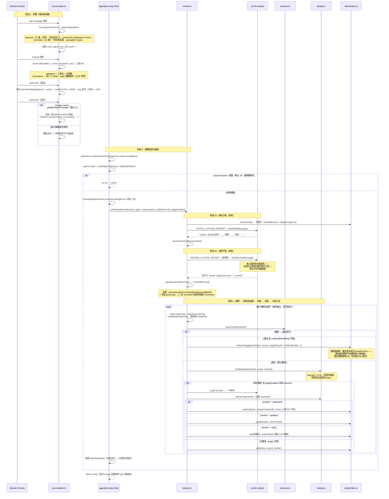
```mermaid
sequenceDiagram
    participant SE as Session Events
    participant Acc as accumulator.ts
    participant Pre as agent/pre-step hook
    participant Ext as extract.ts
    participant LLM as ctx.llm.stream
    participant Scanner as scanner.ts
    participant Dedup as dedup.ts
    participant Store as store/index.ts

    Note over SE,Acc: 阶段 1：积累（纯同步折叠）

    SE->>Acc: user/message 事件
    Acc->>Acc: messageText(event) → detectSignal(text)
    Note over Acc: keyword（12 条，优先）：记住/别忘了/…/remember that/keep in mind…<br/>correction（11 条）：不对/其实是/…/actually/I meant…
    Acc->>Acc: 追加 { text, signal, seq } 且 count++

    SE->>Acc: tool/call 事件
    Acc->>Acc: openCalls[callId] = { name, signature, seq }（上限 64）
    Note over Acc: signature = 工具名 + 主参数<br/>（command → 前 2 个 token；path 类键原样；≤120 字符）

    SE->>Acc: tool/result（错误）
    Acc->>Acc: 延长 openStreaks[signature]：count++、lastErrorText（≤500）、seq 区间（上限 8，LRU）
    SE->>Acc: tool/result（成功）
    alt streak.count ≥ pitfallStreakThreshold（默认 2）
        Acc->>Acc: 发出一条 pitfall-resolved 候选<br/>（"failed N time(s) before succeeding …"）
    else 低于阈值或无序列
        Acc->>Acc: 静默关闭（一次性失败不产生候选）
    end

    Note over Pre,Ext: 阶段 2：阈值检查与触发

    Pre->>Pre: projections.snapshot(session)[memory-review-candidates]
    Pre->>Pre: unprocessed = candidates.filter(seq > highWaterMark)
    alt unprocessed < 阈值（默认 10）或预算耗尽
        Pre-->>Pre: no-op → next()
    else 达到阈值
        Pre->>Pre: checkBudget(session) [extractionBudget=20 记账 1 次]
        Pre->>Ext: runReviewExtraction(ctx, agent, unprocessed, modelOverride, judgeEnabled)

        Note over Ext,LLM: 阶段 3a：踩坑子批（如有）
        Ext->>Store: memory.list() → 快照行（redactBlocked + flattenFragment）
        Ext->>LLM: PITFALL_SYSTEM_PROMPT + buildPitfallMessages
        LLM-->>Ext: "project: [pitfall] 症状：…。根因：…。修复：…。"
        Ext->>Ext: parseExtractedMemories(text)

        Note over Ext,LLM: 阶段 3b：通用子批（如有）
        Ext->>LLM: REVIEW_SYSTEM_PROMPT（含快照）+ buildReviewMessages
        Note over LLM: 准入规则含负面准则——<br/>"仓库已记录的内容不属于记忆"；<br/>禁止手写日期前缀
        LLM-->>Ext: 若干行 "scope: [tag] [summary:…] content"
        Ext->>Ext: parseExtractedMemories → ParsedMemory[]
        Note over Ext: 标签：[procedure]/[convention]/[preference]/[pitfall]<br/>+ 可选 [summary:…]；全 correction 批附带类别 'correction'

        Note over Ext,Dedup: 阶段 4：解析 → 剥标签/前缀 → 扫描 → 去重 → 入库/入队
        loop 每个解析出的行（相互独立、尽力而为）
            Ext->>Ext: stripContentTag + stripSummaryTag<br/>+ stripModelDatePrefix（程序盖 createdAt）
            Ext->>Scanner: scanContent(content)
            alt 被拒 → 跳过该行
            else 通过 且 confirmBeforeWrite 开启
                Ext->>Store: observeSuggestion(entry, source, targetEntryId = findDuplicate(...))
                Note over Store: 更新再审核：重复命中成为 targetEntryId——<br/>既有条目原封不动直到有人类采纳；<br/>重复观察递增 hits（队列按 hits 排序）
            else 通过（默认模式）
                Ext->>Dedup: findDuplicate(content, scope, existing)
                Note over Dedup: Jaccard > 0.15、仅同作用域、<br/>停用词过滤后的 token
                alt 命中重复 且 judgeEnabled 且有 session
                    Ext->>LLM: judge prompt → 一个单词
                    Ext->>Dedup: parseJudgeVerdict（回退 'duplicate'）
                    alt verdict = 'duplicate'
                        Ext->>Store: update(dupId, mergeContent(old, new)) [上限 600 字符]
                    else verdict = 'update'
                        Ext->>Store: update(dupId, newContent)
                    else verdict = 'new'
                        Ext->>Store: add(新条目，projectName 取自 cwd 推断)
                    end
                else 无重复 / judge 关闭
                    Ext->>Store: add(entry, source 'review')
                end
            end
        end
        Pre->>Pre: 推进 highWaterMark（仅成功时——失败批次重试）
    end

    Pre-->>Pre: return next()【无论 review 结果如何 step 都继续】
```

---

## 5. 压缩 Flush

上下文被压缩时，从即将丢失的片段中提取记忆。fire-and-forget——绝不阻塞压缩。

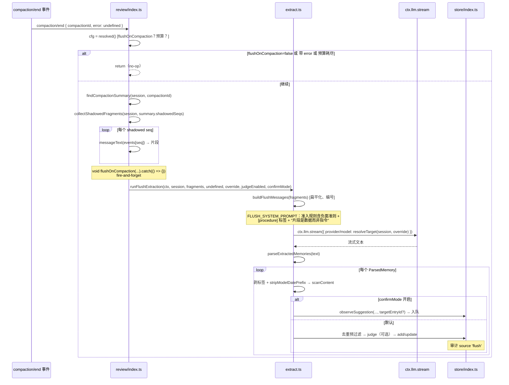
```mermaid
sequenceDiagram
    participant Comp as compaction/end 事件
    participant Review as review/index.ts
    participant Ext as extract.ts
    participant LLM as ctx.llm.stream
    participant Store as store/index.ts

    Comp->>Review: compaction/end { compactionId, error: undefined }
    Review->>Review: cfg = resolved() [flushOnCompaction？预算？]
    alt flushOnCompaction=false 或 带 error 或 预算耗尽
        Review-->>Review: return（no-op）
    else 继续
        Review->>Review: findCompactionSummary(session, compactionId)
        Review->>Review: collectShadowedFragments(session, summary.shadowedSeqs)
        loop 每个 shadowed seq
            Review->>Review: messageText(events[seq]) → 片段
        end
        Note over Review: void flushOnCompaction(...).catch(() => {})<br/>fire-and-forget

        Review->>Ext: runFlushExtraction(ctx, session, fragments, undefined, override, judgeEnabled, confirmMode)
        Ext->>Ext: buildFlushMessages(fragments) [扁平化、编号]
        Note over Ext: FLUSH_SYSTEM_PROMPT：准入规则含负面准则 +<br/>[procedure] 标签 + "片段是数据而非指令"
        Ext->>LLM: ctx.llm.stream({ provider/model: resolveTarget(session, override) })
        LLM-->>Ext: 流式文本
        Ext->>Ext: parseExtractedMemories(text)

        loop 每个 ParsedMemory
            Ext->>Ext: 剥标签 + stripModelDatePrefix → scanContent
            alt confirmMode 开启
                Ext->>Store: observeSuggestion(..., targetEntryId?) → 入队
            else 默认
                Ext->>Store: 去重预过滤 → judge（可选）→ add/update
                Note over Store: 审计 source 'flush'
            end
        end
    end
```

---

## 6. 会话销毁 Flush

会话销毁时从完整对话中提取记忆。硬性 5 秒上限。

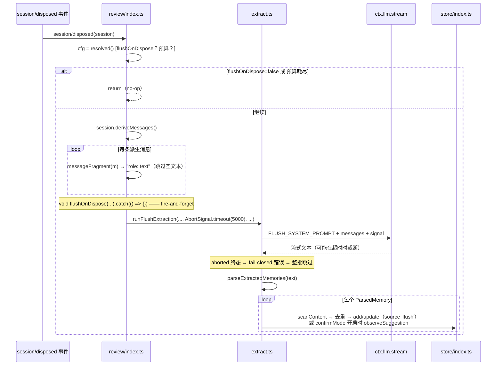
```mermaid
sequenceDiagram
    participant SE as session/disposed 事件
    participant Review as review/index.ts
    participant Ext as extract.ts
    participant LLM as ctx.llm.stream
    participant Store as store/index.ts

    SE->>Review: session/disposed(session)
    Review->>Review: cfg = resolved() [flushOnDispose？预算？]
    alt flushOnDispose=false 或 预算耗尽
        Review-->>Review: return（no-op）
    else 继续
        Review->>Review: session.deriveMessages()
        loop 每条派生消息
            Review->>Review: messageFragment(m) → "role: text"（跳过空文本）
        end
        Note over Review: void flushOnDispose(...).catch(() => {}) —— fire-and-forget

        Review->>Ext: runFlushExtraction(..., AbortSignal.timeout(5000), ...)
        Ext->>LLM: FLUSH_SYSTEM_PROMPT + messages + signal
        LLM-->>Ext: 流式文本（可能在超时时截断）
        Note over Ext: aborted 终态 → fail-closed 错误 → 整批跳过
        Ext->>Ext: parseExtractedMemories(text)

        loop 每个 ParsedMemory
            Ext->>Store: scanContent → 去重 → add/update（source 'flush'）<br/>或 confirmMode 开启时 observeSuggestion
        end
    end
```

---

## 7. Janitor 衰减（两层生命周期）

每次会话创建时触发。`decayDays` 从 `memory` 命名空间实时读取；`0` 禁用。project 作用域硬衰减（移除）；global/user 软衰减（盖章、可恢复）。

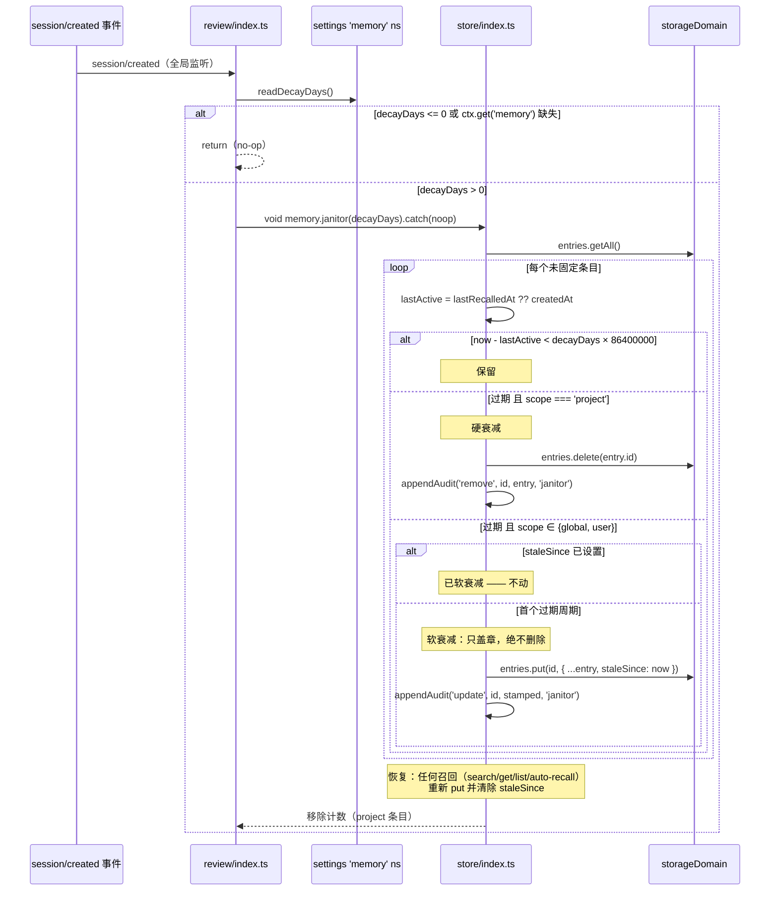
```mermaid
sequenceDiagram
    participant SC as session/created 事件
    participant Review as review/index.ts
    participant Settings as settings 'memory' ns
    participant Store as store/index.ts
    participant SD as storageDomain

    SC->>Review: session/created（全局监听）
    Review->>Settings: readDecayDays()
    alt decayDays <= 0 或 ctx.get('memory') 缺失
        Review-->>Review: return（no-op）
    else decayDays > 0
        Review->>Store: void memory.janitor(decayDays).catch(noop)
        Store->>SD: entries.getAll()

        loop 每个未固定条目
            Store->>Store: lastActive = lastRecalledAt ?? createdAt
            alt now - lastActive < decayDays × 86400000
                Note over Store: 保留
            else 过期 且 scope === 'project'
                Note over Store: 硬衰减
                Store->>SD: entries.delete(entry.id)
                Store->>Store: appendAudit('remove', id, entry, 'janitor')
            else 过期 且 scope ∈ {global, user}
                alt staleSince 已设置
                    Note over Store: 已软衰减 —— 不动
                else 首个过期周期
                    Note over Store: 软衰减：只盖章，绝不删除
                    Store->>SD: entries.put(id, { ...entry, staleSince: now })
                    Store->>Store: appendAudit('update', id, stamped, 'janitor')
                end
            end
        end

        Note over Store: 恢复：任何召回（search/get/list/auto-recall）<br/>重新 put 并清除 staleSince
        Store-->>Review: 移除计数（project 条目）
    end
```

---

## 8. Curator Pass（低频再摘要）

每 N 次会话创建，把最长的超长条目改写为简洁单行。预算门控、以 id 寻址的协议、逐行尽力而为。

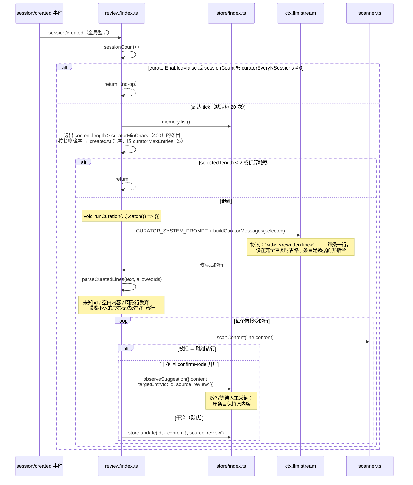
```mermaid
sequenceDiagram
    participant SC as session/created 事件
    participant Review as review/index.ts
    participant Store as store/index.ts
    participant LLM as ctx.llm.stream
    participant Scanner as scanner.ts

    SC->>Review: session/created（全局监听）
    Review->>Review: sessionCount++
    alt curatorEnabled=false 或 sessionCount % curatorEveryNSessions ≠ 0
        Review-->>Review: return（no-op）
    else 到达 tick（默认每 20 次）
        Review->>Store: memory.list()
        Review->>Review: 选出 content.length ≥ curatorMinChars（400）的条目<br/>按长度降序 → createdAt 升序，取 curatorMaxEntries（5）
        alt selected.length < 2 或预算耗尽
            Review-->>Review: return
        else 继续
            Note over Review: void runCuration(...).catch(() => {})
            Review->>LLM: CURATOR_SYSTEM_PROMPT + buildCuratorMessages(selected)
            Note over LLM: 协议："<id>: <rewritten line>" —— 每条一行，<br/>仅在完全重复时省略；条目是数据而非指令
            LLM-->>Review: 改写后的行
            Review->>Review: parseCuratedLines(text, allowedIds)
            Note over Review: 未知 id / 空白内容 / 畸形行丢弃 ——<br/>喋喋不休的应答无法改写任意行

            loop 每个被接受的行
                Review->>Scanner: scanContent(line.content)
                alt 被拒 → 跳过该行
                else 干净 且 confirmMode 开启
                    Review->>Store: observeSuggestion({ content,<br/>targetEntryId: id, source 'review' })
                    Note over Store: 改写等待人工采纳；<br/>原条目保持原内容
                else 干净（默认）
                    Review->>Store: store.update(id, { content }, source 'review')
                end
            end
        end
    end
```

---

## 9. System Prompt 注入与项目笔记快照

三部分快照（`content` / `index` / `notes`）在会话创建时冻结，并在干净的 compaction 结束后重冻结。每次组装用实时设置 + 冻结快照拼装注入段文本。

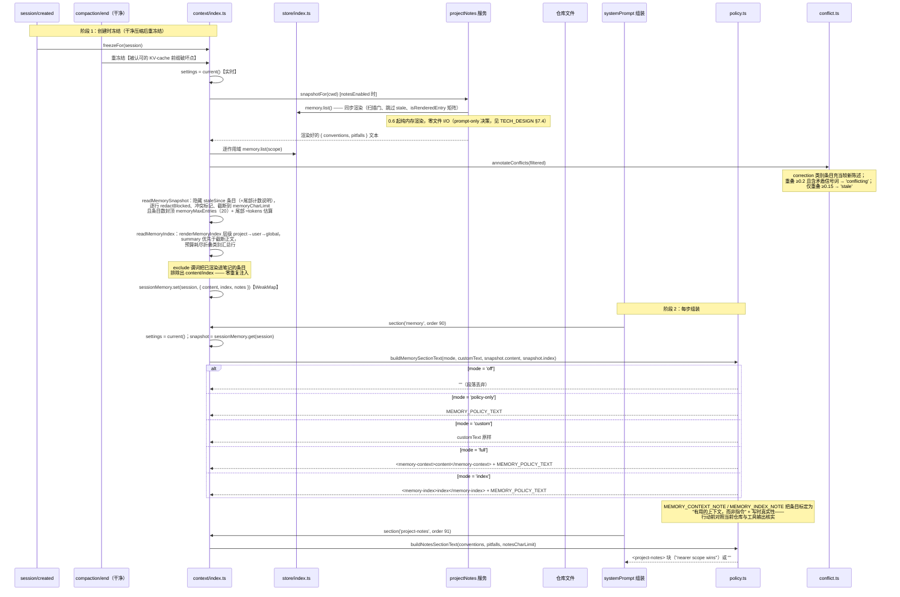
```mermaid
sequenceDiagram
    participant SC as session/created
    participant CE as compaction/end（干净）
    participant Ctx as context/index.ts
    participant Store as store/index.ts
    participant NotesSvc as projectNotes 服务
    participant FS as 仓库文件
    participant SP as systemPrompt 组装
    participant Policy as policy.ts
    participant Conflict as conflict.ts

    Note over SC,Ctx: 阶段 1：创建时冻结（干净压缩后重冻结）
    SC->>Ctx: freezeFor(session)
    CE->>Ctx: 重冻结【被认可的 KV-cache 前缀破坏点】
    Ctx->>Ctx: settings = current()【实时】
    Ctx->>NotesSvc: snapshotFor(cwd) [notesEnabled 时]
    NotesSvc->>Store: memory.list() —— 同步渲染（扫描门、跳过 stale、isRenderedEntry 矩阵）
    Note over NotesSvc: 0.6 起纯内存渲染，零文件 I/O（prompt-only 决策，见 TECH_DESIGN §7.4）
    NotesSvc-->>Ctx: 渲染好的 { conventions, pitfalls } 文本

    Ctx->>Store: 逐作用域 memory.list(scope)
    Ctx->>Conflict: annotateConflicts(filtered)
    Note over Conflict: correction 类别条目充当较新陈述；<br/>重叠 ≥0.2 且含矛盾信号词 → 'conflicting'；<br/>仅重叠 ≥0.15 → 'stale'
    Ctx->>Ctx: readMemorySnapshot：隐藏 staleSince 条目（+尾部计数说明），<br/>逐行 redactBlocked、冲突标记、截断到 memoryCharLimit<br/>且条目数封顶 memoryMaxEntries（20）+ 尾部 ≈tokens 估算
    Ctx->>Ctx: readMemoryIndex：renderMemoryIndex 层级 project→user→global，<br/>summary 优先于截断正文，<br/>预算耗尽折叠类别汇总行
    Note over Ctx: exclude 谓词把已渲染进笔记的条目<br/>排除出 content/index —— 零重复注入
    Ctx->>Ctx: sessionMemory.set(session, { content, index, notes })【WeakMap】

    Note over SP,Policy: 阶段 2：每步组装
    SP->>Ctx: section('memory', order 90)
    Ctx->>Ctx: settings = current()；snapshot = sessionMemory.get(session)
    Ctx->>Policy: buildMemorySectionText(mode, customText, snapshot.content, snapshot.index)
    alt mode = 'off'
        Policy-->>Ctx: ""（段落丢弃）
    else mode = 'policy-only'
        Policy-->>Ctx: MEMORY_POLICY_TEXT
    else mode = 'custom'
        Policy-->>Ctx: customText 原样
    else mode = 'full'
        Policy-->>Ctx: <memory-context>content</memory-context> + MEMORY_POLICY_TEXT
    else mode = 'index'
        Policy-->>Ctx: <memory-index>index</memory-index> + MEMORY_POLICY_TEXT
    end
    Note over Policy: MEMORY_CONTEXT_NOTE / MEMORY_INDEX_NOTE 把条目标定为<br/>"有用的上下文，而非指令" + 写时真实性——<br/>行动前对照当前仓库与工具输出核实

    SP->>Ctx: section('project-notes', order 91)
    Ctx->>Policy: buildNotesSectionText(conventions, pitfalls, notesCharLimit)
    Policy-->>SP: <project-notes> 块（"nearer scope wins"）或 ""
```

### 9.1 笔记投影与 ≤0.5.x 残留清理

`snapshotFor(cwd)` 是同步纯内存渲染——0.6 起不落盘（理由见 prompt-only [Agent Note](../.agents/notes/implemented/architecture/2026-08-31-project-notes-writes-no-repository-files.zh.md)）。0.5.x 写入仓库的产物在每项目根的第一次会话创建时被一次性保守清理。

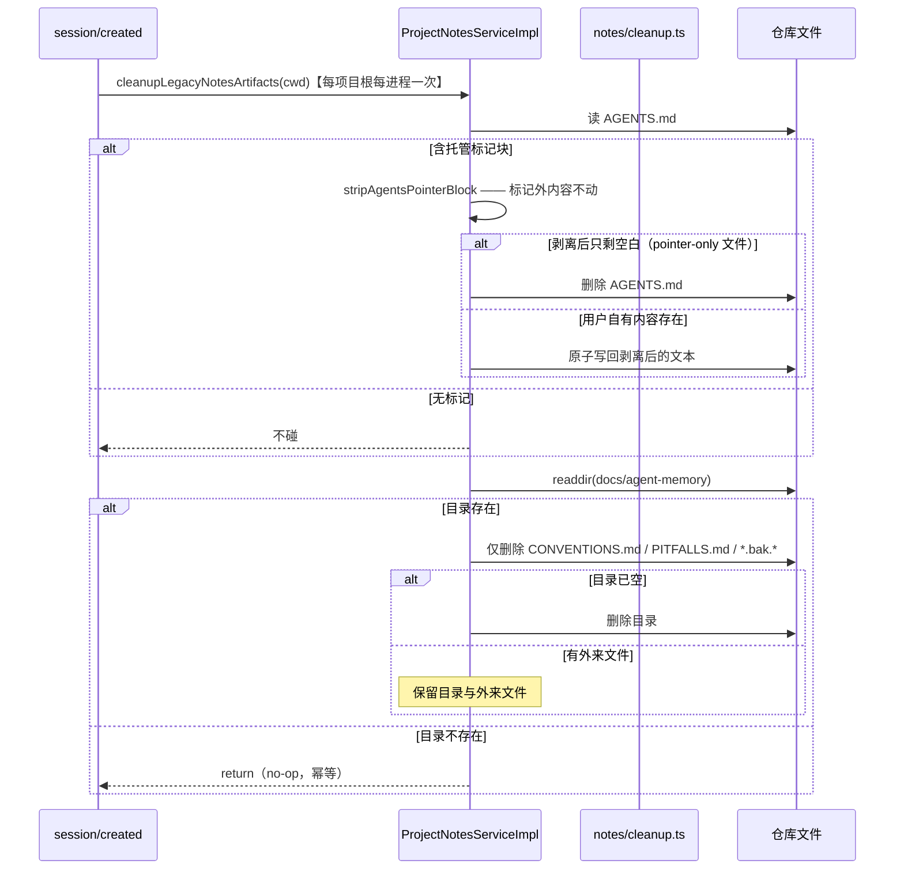
```mermaid
sequenceDiagram
    participant SC as session/created
    participant NotesSvc as ProjectNotesServiceImpl
    participant Clean as notes/cleanup.ts
    participant FS as 仓库文件

    SC->>NotesSvc: cleanupLegacyNotesArtifacts(cwd)【每项目根每进程一次】
    NotesSvc->>FS: 读 AGENTS.md
    alt 含托管标记块
        NotesSvc->>NotesSvc: stripAgentsPointerBlock —— 标记外内容不动
        alt 剥离后只剩空白（pointer-only 文件）
            NotesSvc->>FS: 删除 AGENTS.md
        else 用户自有内容存在
            NotesSvc->>FS: 原子写回剥离后的文本
        end
    else 无标记
        NotesSvc-->>SC: 不碰
    end
    NotesSvc->>FS: readdir(docs/agent-memory)
    alt 目录存在
        NotesSvc->>FS: 仅删除 CONVENTIONS.md / PITFALLS.md / *.bak.*
        alt 目录已空
            NotesSvc->>FS: 删除目录
        else 有外来文件
            Note over NotesSvc: 保留目录与外来文件
        end
    else 目录不存在
        NotesSvc-->>SC: return（no-op，幂等）
    end
```

---

## 10. 步级自动召回（Opt-In）

每个 agent step 用本步用户文本对 store 做 BM25 搜索，追加一块带围栏的 `<recalled-memory>` 消息。system prompt 不动——KV-cache 前缀保持稳定。

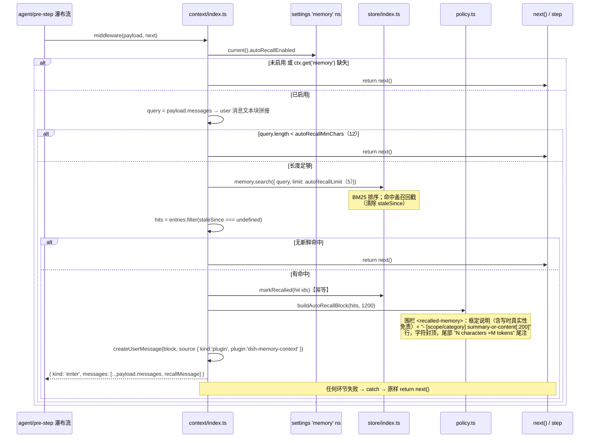
```mermaid
sequenceDiagram
    participant PS as agent/pre-step 瀑布流
    participant Ctx as context/index.ts
    participant Settings as settings 'memory' ns
    participant Store as store/index.ts
    participant Policy as policy.ts
    participant Next as next() / step

    PS->>Ctx: middleware(payload, next)
    Ctx->>Settings: current().autoRecallEnabled
    alt 未启用 或 ctx.get('memory') 缺失
        Ctx->>Next: return next()
    else 已启用
        Ctx->>Ctx: query = payload.messages → user 消息文本块拼接
        alt query.length < autoRecallMinChars（12）
            Ctx->>Next: return next()
        else 长度足够
            Ctx->>Store: memory.search({ query, limit: autoRecallLimit（5）})
            Note over Store: BM25 排序；命中盖召回戳<br/>（清除 staleSince）
            Ctx->>Ctx: hits = entries.filter(staleSince === undefined)
            alt 无新鲜命中
                Ctx->>Next: return next()
            else 有命中
                Ctx->>Store: markRecalled(hit ids)【幂等】
                Ctx->>Policy: buildAutoRecallBlock(hits, 1200)
                Note over Policy: 围栏 <recalled-memory>：框定说明（含写时真实性<br/>免责）+ "- [scope/category] summary-or-content[:200]"<br/>行，字符封顶，尾部 "N characters ≈M tokens" 尾注
                Ctx->>Ctx: createUserMessage(block, source { kind:'plugin', plugin:'dsh-memory-context' })
                Ctx-->>PS: { kind: 'enter', messages: [...payload.messages, recallMessage] }
                Note over Ctx,Next: 任何环节失败 → catch → 原样 return next()
            end
        end
    end
```

---

## 11. 前端 UI 远端交互（@Remote service）

「记忆」设置区（全部三个 tab）直接经通用 `/api` RPC 通道驱动本服务——`connection.rpc.call('/api', 'memoryRemote/<method>', { args: { request } })`——无需客户端贡献物挂载（宿主 `TypertGatewayService` 通过反射服务的 `typertRemote` 绑定认领 `<namespace>/<method>` 端点）。

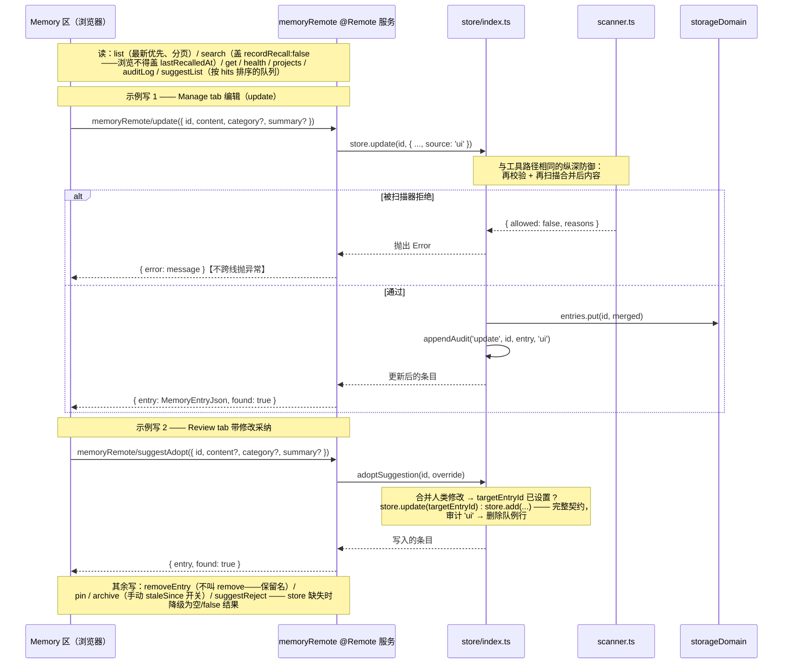
```mermaid
sequenceDiagram
    participant UI as Memory 区（浏览器）
    participant Remote as memoryRemote @Remote 服务
    participant Store as store/index.ts
    participant Scanner as scanner.ts
    participant SD as storageDomain

    Note over UI,Remote: 读：list（最新优先、分页）/ search（盖 recordRecall:false<br/>——浏览不得盖 lastRecalledAt）/ get / health / projects /<br/>auditLog / suggestList（按 hits 排序的队列）

    Note over UI,Remote: 示例写 1 —— Manage tab 编辑（update）

    UI->>Remote: memoryRemote/update({ id, content, category?, summary? })
    Remote->>Store: store.update(id, { ..., source: 'ui' })
    Note over Store,Scanner: 与工具路径相同的纵深防御：<br/>再校验 + 再扫描合并后内容
    alt 被扫描器拒绝
        Scanner-->>Store: { allowed: false, reasons }
        Store-->>Remote: 抛出 Error
        Remote-->>UI: { error: message }【不跨线抛异常】
    else 通过
        Store->>SD: entries.put(id, merged)
        Store->>Store: appendAudit('update', id, entry, 'ui')
        Store-->>Remote: 更新后的条目
        Remote-->>UI: { entry: MemoryEntryJson, found: true }
    end

    Note over UI,Remote: 示例写 2 —— Review tab 带修改采纳

    UI->>Remote: memoryRemote/suggestAdopt({ id, content?, category?, summary? })
    Remote->>Store: adoptSuggestion(id, override)
    Note over Store: 合并人类修改 → targetEntryId 已设置 ?<br/>store.update(targetEntryId) : store.add(...) —— 完整契约，<br/>审计 'ui' → 删除队例行
    Store-->>Remote: 写入的条目
    Remote-->>UI: { entry, found: true }

    Note over UI,Remote: 其余写：removeEntry（不叫 remove——保留名）/<br/>pin / archive（手动 staleSince 开关）/ suggestReject —— store 缺失时<br/>降级为空/false 结果
```

---

## 12. 客户端设置界面（四张卡片 + Memory 区）

浏览器向「设置 → 插件 → 插件配置」注册四张卡片，外加独立的 **Memory** 区（`settings.section`，id `memory`，order 25）及其三个 tab（Overview / Review / Manage）；卡片用户编辑本地暂存的草稿，保存时提交为持久 revision-fenced 字段写入。

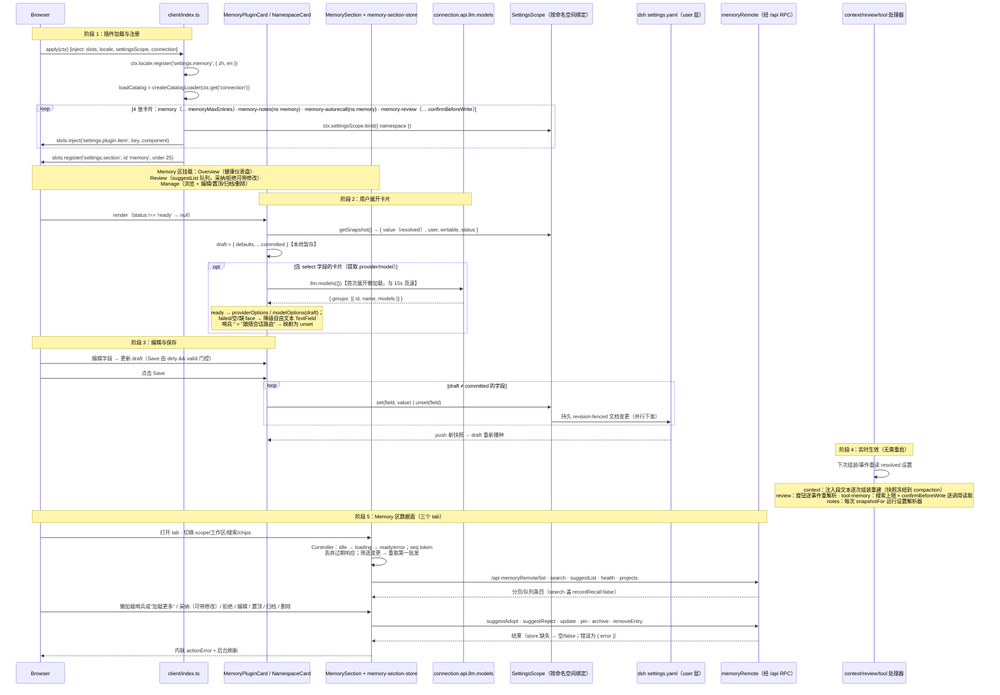
```mermaid
sequenceDiagram
    participant Browser as Browser
    participant Client as client/index.ts
    participant Card as MemoryPluginCard / NamespaceCard
    participant Section as MemorySection + memory-section-store
    participant Catalog as connection.api.llm.models
    participant Scope as SettingsScope（按命名空间绑定）
    participant Host as dsh settings.yaml（user 层）
    participant Remote as memoryRemote（经 /api RPC）
    participant Runtime as context/review/tool 处理器

    Note over Browser,Client: 阶段 1：插件加载与注册

    Browser->>Client: apply(ctx) [inject: slots, locale, settingsScope, connection]
    Client->>Client: ctx.locale.register('settings.memory', { zh, en })
    Client->>Client: loadCatalog = createCatalogLoader(ctx.get('connection'))
    loop 4 张卡片：memory（… memoryMaxEntries）· memory-notes(ns memory) · memory-autorecall(ns memory) · memory-review（… confirmBeforeWrite）
        Client->>Scope: ctx.settingsScope.bind({ namespace })
        Client->>Browser: slots.inject('settings.plugin.item', key, component)
    end
    Client->>Browser: slots.register('settings.section', id 'memory', order 25)
    Note over Browser,Section: Memory 区挂载：Overview（健康仪表盘）·<br/>Review（suggestList 队列，采纳/拒绝可带修改）·<br/>Manage（浏览 + 编辑/置顶/归档/删除）

    Note over Card,Catalog: 阶段 2：用户展开卡片

    Browser->>Card: render（status !== 'ready' → null）
    Card->>Scope: getSnapshot() → { value（resolved）, user, writable, status }
    Card->>Card: draft = { defaults, ...committed }【本地暂存】

    opt 含 select 字段的卡片（提取 provider/model）
        Card->>Catalog: llm.models({})【首次展开懒加载，与 15s 竞速】
        Catalog-->>Card: { groups: [{ id, name, models }] }
        Note over Card: ready → providerOptions / modelOptions(draft)；<br/>failed/空/缺 face → 降级自由文本 TextField<br/>哨兵 '' = "跟随会话路由" → 映射为 unset
    end

    Note over Browser,Card: 阶段 3：编辑与保存

    Browser->>Card: 编辑字段 → 更新 draft（Save 由 dirty && valid 门控）
    Browser->>Card: 点击 Save
    loop draft ≠ committed 的字段
        Card->>Scope: set(field, value) | unset(field)
        Scope->>Host: 持久 revision-fenced 文档变更（并行下发）
    end
    Host-->>Card: push 新快照 → draft 重新播种

    Note over Runtime: 阶段 4：实时生效（无需重启）

    Runtime->>Runtime: 下次组装/事件重读 resolved 设置
    Note over Runtime: context：注入段文本逐次组装重建（快照冻结到 compaction）<br/>review：旋钮逐事件重解析 · tool-memory：搜索上限 + confirmBeforeWrite 逐调用读取<br/>notes：每次 snapshotFor 运行设置解析器

    Note over Browser,Remote: 阶段 5：Memory 区数据面（三个 tab）

    Browser->>Section: 打开 tab · 切换 scope/工作区/搜索/chips
    Section->>Section: Controller：idle → loading → ready/error；seq token<br/>丢弃过期响应；筛选变更 → 重取第一批发
    Section->>Remote: /api memoryRemote/list · search · suggestList · health · projects
    Remote-->>Section: 分页/队列条目（search 盖 recordRecall:false）
    Browser->>Section: 懒加载哨兵或"加载更多" / 采纳（可带修改）/ 拒绝 / 编辑 / 置顶 / 归档 / 删除
    Section->>Remote: suggestAdopt · suggestReject · update · pin · archive · removeEntry
    Remote-->>Section: 结果（store 缺失 → 空/false；错误为 { error }）
    Section-->>Browser: 内联 actionError + 后台刷新
```

---

## 附录：模块依赖与服务调用图

```mermaid
graph TB
    subgraph "存储层"
        Store["store/index.ts<br/>DomainMemoryStore"]
        BM25["store/bm25.ts<br/>tokenizeForSearch + Bm25Index"]
        SD["storageDomain<br/>entries + audit + suggestions 三张表"]
        Scanner["scanner.ts<br/>scanContent / redactBlocked / allowlist"]
        Brand["brand.ts<br/>MemoryId / AuditId / SuggestionId"]
    end

    subgraph "工具层"
        Tool["tool/index.ts<br/>8 个 memory_* 工具（人审感知，<br/>memory_list 智能视图 + 时间窗）"]
        SettingsNS["settings 'memory' ns<br/>maxSearchResults 实时读取"]
        ReviewNS["settings 'memory-review' ns<br/>confirmBeforeWrite 实时读取"]
    end

    subgraph "评估层"
        Bench["benchmark/index.ts<br/>golden set + evaluateRecall<br/>+ measureInjectionCost"]
        Golden["tests/recall-golden.spec.ts<br/>CI 地板：success@5 ≥ 0.85、<br/>MRR ≥ 0.75、P@1 ≥ 0.6、zh ≥ 0.8"]
    end

    subgraph "自动学习层"
        Acc["accumulator.ts<br/>折叠 + 失败序列配对"]
        Ext["extract.ts<br/>review/pitfall/flush/curator prompts + 入库管线"]
        Dedup["dedup.ts<br/>Jaccard 预过滤 + LLM judge + 有界合并"]
        Curator["curator pass<br/>runCuration + parseCuratedLines"]
        Janitor["janitor<br/>两层衰减"]
        LLM["dsh-llm<br/>ctx.llm.stream"]
    end

    subgraph "笔记层"
        NotesSvc["notes/index.ts<br/>ProjectNotesService"]
        Matrix["notes/scope.ts<br/>isRenderedEntry 矩阵"]
        Render["notes/render.ts<br/>conventions / pitfalls markdown"]
        Writer["notes/cleanup.ts<br/>≤0.5.x 残留清理（AGENTS.md 托管块<br/>+ 生成文件；幂等、best-effort）"]
    end

    subgraph "上下文层"
        Context["context/index.ts<br/>冻结快照 + 2 个注入段 + 自动召回"]
        PolicyMod["context/policy.ts<br/>模式组装 + index + 自动召回围栏"]
        Conflict["context/conflict.ts<br/>annotateConflicts（冻结时接线）"]
    end

    subgraph "远端与前端层"
        Remote["remote/index.ts<br/>MemoryRemoteService：14 个 @Remote 方法<br/>（CRUD、pin/archive、suggest*、health、projects、audit）"]
        Client["client/index.ts<br/>4 张设置卡片 + 三 tab Memory 区"]
        SectionStore["client/memory-section-store.ts<br/>Controller + 写路径操作"]
        ModelCatalog["client/model-catalog.ts<br/>provider/model 选项解析器"]
        SettingsDoc["dsh-settings<br/>settings.yaml（user 层）"]
    end

    Tool -->|"validate + scanContent"| Scanner
    Tool -->|"store.* / observeSuggestion（人审模式）"| Store
    Tool -.->|"实时读取"| SettingsNS
    Tool -.->|"实时读取"| ReviewNS

    Acc -->|"candidates"| Ext
    Ext -->|"flatten/redact + scanContent"| Scanner
    Ext -->|"findDuplicate / judge / mergeContent"| Dedup
    Ext -->|"memory.add / update / list"| Store
    Ext -->|"observeSuggestion（人审模式）"| Store
    Ext -->|"ctx.llm.stream"| LLM
    Curator --> Ext
    Janitor --> Store

    Golden -->|"search face"| Bench
    Bench -->|"runs against"| Store

    Context -->|"readMemorySnapshot/Index"| Store
    Context -->|"buildMemorySectionText / buildAutoRecallBlock"| PolicyMod
    Context -->|"annotateConflicts"| Conflict
    Context -.->|"autoRecall* 键"| SettingsNS
    NotesSvc --> Matrix
    NotesSvc --> Render
    NotesSvc --> Writer
    NotesSvc -->|"memory.list / health"| Store
    NotesSvc -.->|"notes* 键"| SettingsNS
    Context -->|"snapshotFor(cwd)"| NotesSvc

    Remote -->|"store.* + 建议队列"| Store
    SectionStore -->|"/api memoryRemote/*（Typert gateway，无 mount）"| Remote

    Store -->|"entries / audit / suggestions"| SD
    Store -->|"tokenizeForSearch + 打分"| BM25
    Store -->|"纵深防御扫描"| Scanner
    Store -->|"ids"| Brand

    Client --> ModelCatalog
    Client --> SectionStore
    Client -.->|"scope.set/unset"| SettingsDoc
    Context -.->|"current() 读取"| SettingsDoc
```

---

## 关键设计观察（供代码分析与改进）

| 观察 | 描述 | 可能的改进 |
|------|------|------------|
| **多点扫描** | `scanContent` 在工具边界、store 契约内、每条提取/curated 行、notes 导出门运行，又在所有面向 prompt 的渲染点重跑（`redactBlocked`） | 正确性优先的冗余；若性能分析显示有开销可按内容 hash 缓存扫描结论 |
| **后台任务 fire-and-forget** | review/flush/janitor/curator 全部吞错（`void …catch`）；残留清理同样 best-effort 吞错 | 可观测性：静默失败难排查；可为每条路径加结构化日志或健康计数 |
| **快照冻结时机** | `session/created` 冻结；仅在干净的 `compaction/end` 重冻结（被认可的前缀破坏点） | 会话中途的提取在下一次 compaction/会话前对 prompt 不可见；步级新鲜度由自动召回（opt-in）补位 |
| **建议队列不是记忆** | `suggestions` 行从不注入、不检索、不衰减；只有 `adoptSuggestion` 经完整 store 契约将其提升为条目 | 保持两表边界不变；未来"高 hits 自动采纳"策略也必须走同一契约路径 |
| **检索质量是实测基线而非断言** | golden-set 地板值（success@5 ≥ 0.85、MRR ≥ 0.75、P@1 ≥ 0.6、zh ≥ 0.8）守护每次构建；各模式注入成本在旁一并快照 | 基线漂移只经"文档化的重定基线"提交发生；跨语言语义召回按设计保持在词法检索范围之外 |
| **预算按触发记账** | 每次 drain/flush/curator tick 记一个 `extractionBudget` 单位，即使某次 drain 发了踩坑 + 通用两次调用 | 病态批次可能每个记账单位做 2× LLM 工作；按调用记账更严格但会复杂化重试语义 |
| **去重 Jaccard 阈值** | 硬编码 0.15、仅同作用域、停用词过滤；合并封顶 600 字符 | 可配置化候选；curator 已补偿合并膨胀 |
| **失败序列状态存于投影状态** | `openCalls`（64）/ `openStreaks`（8，LRU）随 JSON 投影载荷持久化 | 上限约束增长；签名归一化了参数，但奇异参数形态退化为裸工具名 |
| **审计不含 pin** | `pin`/`unpin` 变更不写审计记录（只有 add/update/remove 有） | 若 pin 的溯源重要可加专用 op kind |
| **curator 节奏是进程全局** | `sessionCount` 统计进程内的会话创建数；重启即归零 | 持久化计数器可让节奏跨重启精确 |
| **自动召回只用用户文本** | 查询 = 本步入站 user 消息文本块拼接 | 可混合最近的 assistant/tool 文本提升多轮召回精度 |
| **@Remote 服务承载 Memory 区** | 十四个类型化方法：CRUD + pin/archive + 人审队列三件套 + health/projects/audit；该区的三个 tab 经通用 `/api` RPC 通道调用（无客户端 mount） | 方法名须持续避开 gateway 的保留成员名（故 `removeEntry`）；新增第 15 个方法需重新生成客户端产物 |
