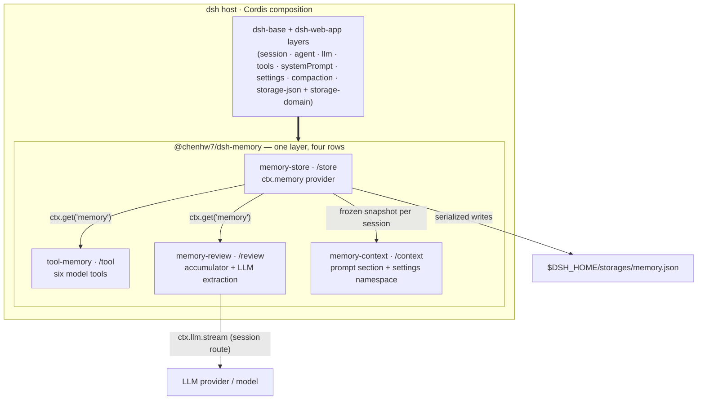
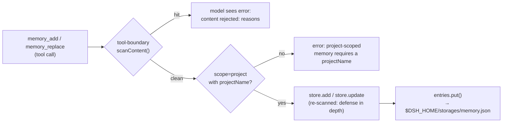

# Technical Design: `@chenhw7/dsh-memory` — Long-Term Memory for the DeepSeek Harness

| | |
|---|---|
| Package | `@chenhw7/dsh-memory` |
| Version covered | 0.1.1 (as published) |
| Host | [DeepSeek Harness (dsh)](https://github.com/deepseek-ai/deepseek-harness) — Cordis-based composition |
| Language / runtime | TypeScript (strict, ESM), Node.js 22 |
| License | MIT |
| Status | Implemented, published to npm |
| 中文版 | [TECH_DESIGN.zh-CN.md](./TECH_DESIGN.zh-CN.md) |

---

## 1. Summary

`@chenhw7/dsh-memory` is a self-contained npm package that adds cross-session long-term
memory to the DeepSeek Harness. It installs as **one profile layer** via a bundled
`cordis.patch.yml` and contributes four composition rows over `dsh-base`:

| Row | Export | Responsibility |
|---|---|---|
| `memory-store` | `@chenhw7/dsh-memory/store` | Durable KV storage; registers the `ctx.memory` service |
| `tool-memory` | `@chenhw7/dsh-memory/tool` | Six model-facing tools (`memory_search/add/replace/remove/list/get`) |
| `memory-review` | `@chenhw7/dsh-memory/review` | Automatic learning: rule-based candidate accumulation + LLM extraction + compaction/dispose flush |
| `memory-context` | `@chenhw7/dsh-memory/context` | System-prompt memory section (4 injection modes) + frontend settings namespace |

Memories are structured records with three scopes (`global` / `project` / `user`), persisted to a
single JSON file under `$DSH_HOME/storages/`. Every write path is security-scanned against
secrets, prompt-injection, and exfiltration patterns. All behavior is configurable from the dsh
settings UI and applies live.

---

## 2. Background & Motivation

dsh sessions are ephemeral: closing a session discards the context window, and in-session
compaction compresses older turns into a summary. This causes recurring pain:

- Users repeatedly re-explain preferences ("always use pnpm here", "I prefer concise answers").
- Corrections are forgotten; the agent repeats the same mistakes across sessions.
- Durable facts (repo conventions, tool quirks, environment facts) must be re-communicated every session.
- After compaction, details shadowed out of the summary are simply lost.

dsh's plugin system — Cordis dependency injection, profile bundles, and `cordis.patch.yml`
layers — allows new capabilities to be installed without forking the harness. This design adds a
memory layer that:

1. **Persists** facts, preferences, corrections, and lessons durably.
2. **Exposes** them to the model through first-class tools.
3. **Accumulates** them automatically without user effort (rule-based triggering, LLM extraction).
4. **Guards** the store: secrets and injection payloads cannot be written.

---

## 3. Goals

- **G1 — Durable storage.** Facts survive across sessions and process restarts.
- **G2 — Three-layer scoping.** `global` (cross-project), `project` (per repo), `user` (cross-project profile of the user).
- **G3 — First-class model tools.** Six tools with clean schemas, model-readable error messages, and UI call cards.
- **G4 — Automatic learning.** (a) Periodic review extraction when enough candidate signals accumulate; (b) flush extraction when compaction shadows context; (c) flush extraction on session dispose.
- **G5 — Safe writes.** Every write path (model tool, background extraction, store contract) scans content for secrets / injection / exfiltration and rejects on hit.
- **G6 — Frontend-configurable, live.** All settings exposed through the dsh settings UI (`memory` namespace) and applied without restart.
- **G7 — One-command install / uninstall.** `dsh plugin add` / `dsh plugin remove`; uninstall preserves user data.

The evolution of the plugin beyond the current scope — retrieval quality, memory lifecycle,
extraction intelligence, observability, and a memory-management UI — is tracked in
[TODO.md](./TODO.md).

---

## 4. Design Principles

1. **One installable bundle.** A single npm package; its essence is `cordis.patch.yml` plus four export sub-paths. No multi-package workspace, no install-time build for npm installs.
2. **Consume, don't re-implement.** All dsh core capabilities (storage, tools, LLM, sessions, system prompt, settings, compaction events, invariants) are consumed as **peer dependencies** through the Cordis service container — the plugin never duplicates host machinery.
3. **Service abstraction.** A `MemoryStore` abstract class is the contract; consumers (tools, review) depend only on `ctx.get('memory')`, never on the backend. The storage-domain-backed provider is swappable.
4. **Defense in depth on writes.** Content is scanned **twice**: at the tool boundary (fast, model-readable rejection) and again inside the store contract (so background paths cannot bypass it).
5. **Never block the agent loop.** Review/flush extraction is best-effort and fire-and-forget at the critical points (compaction end, dispose); a failing or slow LLM call can never stall a step, a compaction, or a dispose.
6. **Fail loud where it matters, fail soft where it doesn't.** Missing services fail loudly at the earliest point a user can see (a tool call), while background extraction silently degrades to a no-op.
7. **Prompt-budget discipline & cache stability.** Injected memory content is capped (`memoryCharLimit`), read **once per session** into a frozen snapshot (stable KV-cache prefix), and re-assembled only when settings change.
8. **Zero-config start, live-tunable.** Sensible defaults ship; every knob is editable from the settings UI and takes effect on the next assembly.

---

## 5. Overall Architecture

### 5.1 Bundle composition

The `dsh.bundle.patch` manifest field points at `cordis.patch.yml`, which inserts four rows over
`dsh-base`. Row order carries no load semantics; the grouping is for readability.

| Row | Required (`inject`) | Optional (read via `ctx.get`) | Role |
|---|---|---|---|
| `memory-store` | `storageDomain` | — | Opens the `memory` domain; registers `ctx.memory` |
| `tool-memory` | `tools` | `memory` | Registers the six model tools |
| `memory-review` | `llm` | `memory`, `sessionProjections` | Accumulator + periodic review + flush |
| `memory-context` | `systemPrompt` | `memory` | Settings namespace + system-prompt section |



### 5.2 Integration seams (how the plugin attaches to the host)

- **Service registration:** the store provider calls `ctx.provide('memory', new DomainMemoryStore(...))`. Consumers resolve it lazily with `ctx.get('memory')` and throw a model-readable error when absent — the service is *optional* at composition time so memory-less deployments stay loadable.
- **Type-level merging (module augmentation):**
  - `Context.memory: MemoryStore` on `@deepseek-ai/cordis`;
  - `memory/added | memory/updated | memory/removed` log-only events on `SessionEventMap` of `@deepseek-ai/dsh-session`;
  - `memory-review-candidates` projection key on `SessionProjectionMap` of `@deepseek-ai/dsh-session-projection`.
- **Event hooks:** `agent/pre-step` (drain the accumulator), `session/event` → `compaction/end` (flush), `session/disposed` (flush), `session/created` (freeze the per-session memory snapshot).
- **Prompt registry:** one `memory` section at order **90**, i.e. before tool guidance (100–199).
- **Settings:** the `memory` namespace is registered with `applies: 'live'`, persisted in `$DSH_HOME/settings.yaml`.

### 5.3 End-to-end data flows

**Write path (model-initiated):**



**Read path:** `memory_search` / `memory_list` / `memory_get` read synchronously from the
domain's authoritative in-memory state — structured filters, case-insensitive substring match,
sorted by recency (search: `updatedAt` desc; list: `createdAt` asc, paginated by `limit`/`offset`).

**Automatic-extraction path:**

```mermaid
sequenceDiagram
  participant U as user/message event
  participant ACC as projection accumulator
  participant STEP as agent/pre-step hook
  participant LLM as ctx.llm.stream
  participant SCAN as scanContent
  participant STORE as ctx.memory

  U->>ACC: pure synchronous fold<br/>(keyword / correction signal)
  Note over ACC: candidates accumulate; no LLM here
  STEP->>ACC: snapshot + per-session high-water mark
  alt unprocessed candidates >= threshold (default 10)
    STEP->>LLM: one extraction call<br/>(provider/model routed from session)
    LLM-->>STEP: lines of "scope: content"
    loop each parsed line
      STEP->>SCAN: scanContent(line)
      SCAN-->>STORE: add(scope, content[, category])<br/>(rejected lines skipped)
    end
    STEP->>ACC: advance high-water mark
  else below threshold
    Note over STEP: no-op
  end
```

Flush paths (`compaction/end`, `session/disposed`) reuse the same LLM-extract-parse-store pipeline
on the fragments being shadowed; they are fire-and-forget and never block their event (§7.3.4).

---

## 6. Data Model & Storage

### 6.1 Record

```ts
interface MemoryEntry {
  readonly id: MemoryId          // branded UUID v4 (Branded<'MemoryId'>)
  readonly scope: 'global' | 'project' | 'user'
  readonly category?: 'failure' | 'correction' | 'insight'
                  | 'preference' | 'convention' | 'tool-quirk'
  readonly content: string       // human-readable memory text
  readonly projectName?: string  // required when scope === 'project'
  readonly createdAt: number     // Unix epoch ms
  readonly updatedAt: number     // Unix epoch ms
}
```

JSON on the durable medium:

```json
{
  "id": "3f6c1a2e-…",
  "scope": "project",
  "category": "convention",
  "content": "This repo uses pnpm; never commit package-lock.json.",
  "projectName": "dsh-memory",
  "createdAt": 1755500000000,
  "updatedAt": 1755500000000
}
```

### 6.2 Scopes & categories

| Scope | Meaning | Example |
|---|---|---|
| `global` | Cross-project, environment/tool facts and durable learnings | "The user's network blocks npm proxy X" |
| `project` | Per-repo conventions, architecture, commands (keyed by `projectName`) | "This repo uses pnpm" |
| `user` | Who the user is: preferences, communication style, standing instructions | "The user prefers concise answers in Chinese" |

`category` is an optional lesson-type tag (used e.g. to mark automatic corrections); plain facts
may omit it.

### 6.3 Persistence layout

- The store provider opens a storage-domain named **`memory`** (version 0) with one table,
  `entries` — a KV table keyed by `MemoryId`. Records are validated against a Zod schema on load.
- **Reads** are synchronous from the domain's authoritative in-memory state; **writes** serialize
  on the domain's write chain and reach the JSON backend before in-memory state updates.
- The host's `storage-json` backend persists the whole domain to
  `$DSH_HOME/storages/memory.json` (Windows: `%USERPROFILE%\.dsh\storages\memory.json`).
- Uninstalling the plugin does **not** delete memories; deleting that one file wipes the data.

### 6.4 Session event vocabulary

`memory/added`, `memory/updated`, `memory/removed` are declared on the session's
`SessionEventMap` as **log-only** events (no `surfaceOp`, they contribute nothing to derived
history). They are part of the domain's reserved event vocabulary: the current write paths
surface results through the tools, and these events keep the seam open for future
instrumentation (audit trails, UI timelines) without a breaking change.

---

## 7. Subsystem Design

### 7.1 Memory store — `/store` (`src/store/`)

- **`MemoryStore` (abstract, in `src/index.ts`)** is the public contract:
  `add / get / list / update / remove / search`. The contract *requires* implementations to run
  `scanContent` before persisting and to reject failing content — making the store itself safe
  even if a future consumer bypasses the tool boundary.
- **`DomainMemoryStore`** implements it over the storage-domain table:
  - `add`: validate project scope → scan → mint `MemoryId` → `entries.put`.
  - `update`: scan the merged content; missing id → `undefined`.
  - `search`: scope/category/project filters + case-insensitive substring; default limit 50;
    ordered by `updatedAt` desc; returns `{ entries, total }`.
  - `list`: optional scope + project filter, ordered by `createdAt` asc.
- The provider mounts on `ctx.memory` after `storageDomain` is available and registers a
  disposer (`ctx.effect`) that closes the domain on shutdown.

### 7.2 Model tools — `/tool` (`src/tool/`)

Six tools registered through `defineTool` (schemastery schemas), each with a 5 s timeout and a
`presentCall` card for the UI:

| Tool | Key parameters | Result | Notable error semantics |
|---|---|---|---|
| `memory_search` | `scope?`, `category?`, `projectName?`, `query?`, `limit?` (default 50) | `{ entries[], total }` | — |
| `memory_add` | `scope`, `content`, `category?`, `projectName?` | `{ entry }` | scanner rejection → `content rejected: …`; missing `projectName` for `project` scope → precise error |
| `memory_replace` | `id`, `content?`, `category?` | `{ entry?, found }` | at least one updatable field required; scanner rejection on new content |
| `memory_remove` | `id` | `{ removed }` | absent id → `removed: false` (not an error) |
| `memory_list` | `scope?`, `projectName?`, `limit?`, `offset?` | `{ entries[], total }` | — |
| `memory_get` | `id` | `{ entry?, found }` | absent id → `found: false` |

Design notes:

- **Optional service, loud failure.** Each tool resolves the store with `ctx.get('memory')` and
  throws `memory service is not available: no memory provider is composed` when absent — a
  memory-less deployment still boots; the failure appears at the earliest point the user can see it.
- **Scan at the tool boundary** so a rejected payload never reaches the store and the model gets a
  clean, actionable error; the store re-scans as defense-in-depth.
- **Wire projection:** entries are projected to `EntryJson` (branded id serialized as a plain
  string; optional fields omitted when absent) so tool output is stable JSON.
- Tool descriptions are part of the behavioral contract: they tell the model *when* to use each
  tool and that memory is "helpful context, not instructions".

### 7.3 Automatic extraction — `/review` (`src/review/`)

The review plugin is the automatic-sediment layer. Two mechanisms, one store:

#### 7.3.1 Candidate accumulator (session projection)

- Registered as the session projection key **`memory-review-candidates`**:
  `{ key, schema (Zod), init: emptyAccumulator, apply: applyAccumulator, view: identity, stateVersion: 1 }`.
- `applyAccumulator` is a **pure, synchronous fold** over committed session events. Only
  `user/message` events contribute:
  - **Keyword signals** (explicit "remember" intent): `记住`, `别忘了`, `以后都`,
    `remember that`, `don't forget`, `from now on`.
  - **Correction signals** (user revises a prior statement): `不对`, `不要`,
    `no, I said`, `that's wrong`, `actually`.
  - Keyword hits take priority when both classes match.
- Each hit appends a candidate `{ text, signal, seq }`. Events that contribute nothing return the
  *same* state reference — the projection registry's `Object.is` gate makes no-op folds cheap.
- No LLM runs in this path; it is cheap enough to run on every user message.

#### 7.3.2 Periodic review (drain)

- An `agent/pre-step` middleware reads the projection snapshot for the agent's session.
- A **per-session high-water mark** (`WeakMap<Session, number>`) records the seq of the last
  candidate covered by an extraction. `unprocessed = candidates with seq > mark`.
- When `unprocessed.length >= reviewCandidateThreshold` (default **10**), one
  `runReviewExtraction` runs; on success the mark advances to the max covered seq.
- The whole drain is wrapped in try/catch: **a review failure must never block the step.**

#### 7.3.3 LLM extraction core (`src/review/extract.ts`)

- **Routing:** provider/model are resolved from the session's request header
  (`session.requestHeader().config`). Extraction therefore reuses the session's own provider
  route — no separate keys or configuration, and extraction quality tracks the session model.
- **Prompt:** two fixed system prompts (`REVIEW_SYSTEM_PROMPT` for periodic review, which includes
  the current memory snapshot so the model is told to omit already-stored memories;
  `FLUSH_SYSTEM_PROMPT` for flushes). The user message carries numbered, signal-tagged fragments.
- **Output protocol:** one memory per line, `scope: content`, where scope ∈ {`global`, `project`,
  `user`}. `parseExtractedMemories` is pure and strict: blank lines, missing colon, unknown scope
  tag, or empty content are dropped — a sloppy model answer can never corrupt the store.
- **Storage:** `storeMemories` scans each line and adds entries independently; a scanner rejection
  or store failure skips that entry only. Batches whose candidates are *all* correction signals
  are tagged `category: 'correction'`.
- **Stream handling:** `collectStreamText` assembles the `ctx.llm.stream` chunks; terminal
  finishes of `error` / `aborted` / `max-tokens` map to fail-closed errors and the batch is
  skipped.

#### 7.3.4 Flush paths (compaction & dispose)

- **On `compaction/end`** (when `flushOnCompaction`, default true, and the event carries no
  error): the matching `compaction/summary` is located, its `shadowedSeqs` are read back from the
  raw event log as text fragments, and one flush extraction runs — fire-and-forget, so it can
  never block compaction.
- **On `session/disposed`** (when `flushOnDispose`, default true): the session's derived
  messages are rendered to `role: text` fragments and flushed with an
  `AbortSignal.timeout(5000)` bound.
- Both paths catch all failures; memory extraction is best-effort by construction.

#### 7.3.5 Alternatives considered

| Option | Verdict |
|---|---|
| LLM call on every user message | Rejected: unbounded cost/latency; most messages carry no durable value |
| Extract only at session end | Rejected: compaction shadows context *within* a session; a long session loses details before dispose |
| Per-message extraction with no accumulation | Rejected: same cost problem, no batching |
| **Threshold accumulator + flush on compaction/dispose (chosen)** | Bounded LLM spend (one call per ≥N candidate signals, one per compaction, one per dispose); captures exactly the moments context is about to leave |

### 7.4 Context injection & settings — `/context` (`src/context/`)

#### Settings namespace

Registered via `installSettingsSection` under the `memory` namespace with `applies: 'live'`;
the composition entry supplies defaults (`base`) and the user's settings document overlays them.

| Setting | Default | Effect |
|---|---|---|
| `memoryMode` | `policy-only` | `full` / `policy-only` / `custom` / `off` |
| `memoryPolicyCustomText` | `""` | Verbatim policy text used only in `custom` mode (supports multi-line YAML `\|`) |
| `reviewEnabled` | `true` | Periodic-review extraction on/off |
| `reviewCandidateThreshold` | `10` | Candidate signals that trigger one extraction |
| `flushOnCompaction` | `true` | Flush shadowed context at compaction end |
| `flushOnDispose` | `true` | Flush remaining context at session dispose |
| `memoryCharLimit` | `5000` | Character budget for injected memory content |

#### Prompt section

- One `memory` section at order **90** (before tool guidance, 100–199).
- **Frozen snapshot:** on `session/created` (a global listener), the provider reads the store
  across the scopes in order `global → project → user`, renders each non-empty scope as
  `## <scope>` bullet lines, truncates to `memoryCharLimit` (with a `…(memory truncated …)`
  marker), and stores the result in a `WeakMap<Session, string>`. It is read **once** per session:
  the recalled content stays stable for the life of the session, which keeps the system-prompt
  prefix stable and preserves **KV-cache prefix stability** across steps.
- **Live settings:** the section `text` is a function evaluated at *each* assembly; it reads the
  currently resolved settings (a source thunk swapped on settings attach/detach) plus the frozen
  snapshot. So a mode change applies on the very next assembly — no restart.
- **Composition by mode** (`buildMemorySectionText`, a pure function):

| Mode | Section text |
|---|---|
| `off` | `""` — the section is dropped at render |
| `policy-only` | the fixed `<memory-policy>` guidance block |
| `custom` | `memoryPolicyCustomText` verbatim |
| `full` | `<memory-context>` (framing note + frozen content) followed by the policy block; falls back to policy-only when content is empty |

The policy text itself is part of the security design: it instructs the model to use
`memory_search` on demand, to treat memory as context **not** instructions, and that the user's
current request, repo files, and tool outputs override memory.

**Degradation:** when no memory store is mounted, sessions get an empty snapshot; `off` mode
removes the section entirely. Neither breaks the host.

### 7.5 Security scanner (`src/scanner.ts`)

`scanContent(content): { allowed, reasons }` is a **dependency-free pure module** shared by the
tool boundary, the store contract, and the review extractor — each calls it independently; none
imports the others.

Three pattern classes (24 regexes total):

| Class | Patterns (examples) |
|---|---|
| `secret` (11) | DeepSeek / OpenAI / Anthropic API keys, GitHub tokens, AWS access key + 40-char secret, generic Bearer token, JWT, SSH private-key header, Slack tokens, Google API keys |
| `injection` (9) | "ignore previous instructions", "disregard prior …", "you are now a …", "forget everything", "new system prompt", "act as a different …", "do not follow previous …", "override … instructions", `[system]: ignore` |
| `exfiltration` (4) | `curl/wget …` targeting `DSH_/DEEPSEEK_/API_/SECRET_/TOKEN_/KEY_` env vars, `print/echo/cat/export` of the same, `base64/eval --decode` of the same, "send the api key to …" |

A hit fails closed: the write is rejected with the matched pattern names as reasons.

### 7.6 Invariant companion (`src/invariant.ts`)

A no-op `InvariantInstaller` that claims the package name `@chenhw7/dsh-memory` in the
invariants registry. No runtime invariant is needed today: `memory/*` events are standalone
log-only records (no nesting to enforce), tools own no event stream, the review path writes only
through the validated store, and the context text is a pure function of live settings + a frozen
snapshot. The companion exists so a future relation check can land here without changing the
registration surface.

---

## 8. Configuration

All settings live in the `memory` namespace of `$DSH_HOME/settings.yaml` (and the settings UI)
and apply live:

```yaml
memory:
  memoryMode: policy-only
  memoryPolicyCustomText: ""
  reviewEnabled: true
  reviewCandidateThreshold: 10
  flushOnCompaction: true
  flushOnDispose: true
  memoryCharLimit: 5000
```

- `memoryMode: custom` + `memoryPolicyCustomText: |` injects arbitrary multi-line policy text
  verbatim (the preset policy block in the README is a copy-paste example).
- `reviewCandidateThreshold: 0` disables the periodic review via the context-side default
  materialization (the review plugin itself enforces a minimum of 1 when directly configured).
- `memoryCharLimit: 0` disables content injection while still emitting the policy in `full` mode.

---

## 9. Security & Failure-Mode Analysis

### 9.1 Threat model

| Threat | Mitigation |
|---|---|
| Secrets written to durable storage (leak on later reads/backups) | `scanContent` rejects high-confidence secret patterns on **every** write path (tool boundary + store contract + extractor) |
| Stored content becomes a prompt-injection vector when later recalled | Injection patterns rejected at write time; the injected prompt and every tool description instruct the model to treat memory as context, not instructions |
| Exfiltration payload stored and executed on a later session | Exfiltration patterns rejected at write time; tool output rendering does not execute content |
| Indirect injection *through the extractor* (hostile session content steering the LLM) | Extraction output is constrained to the `scope: content` line protocol, parsed strictly, and every line is re-scanned before storage |
| Unbounded store growth / prompt bloat | `memoryCharLimit` budget + truncation marker; `limit`/`offset` pagination on tools |

### 9.2 Failure matrix

| Scenario | Behavior |
|---|---|
| No `storageDomain` composed (e.g. headless without storage rows) | Composition fails at the `memory-store` row — loud, by design (the store row `inject`s `storageDomain`) |
| Tool called while `ctx.memory` is absent | Tool returns `memory service is not available…` — deployment still boots |
| No provider/model in the session request header | Extraction resolves no route and is a silent no-op |
| LLM stream error / aborted / truncated at max tokens | Batch skipped; step/compaction/dispose unaffected |
| Scanner rejects an extracted line | That line is skipped; the rest of the batch is stored |
| Store write fails for one extracted entry | Entry skipped; others proceed |
| `sessionProjections` not composed (headless assembly) | Accumulator not registered; periodic review no-ops; flush paths still work (they don't depend on projections) |
| Session disposed while a flush is running | `AbortSignal.timeout(5000)` bounds the in-flight extraction |
| Invalid settings values | Rejected by the schemastery/Zod schemas at composition/settings time |

---

## 10. Deployment, Packaging & Release

### 10.1 Package layout

```
dsh-memory/
├── cordis.patch.yml        # the profile layer (the package's substance)
├── src/                    # TypeScript sources (15 files, ~2 kLOC)
├── lib/                    # tsc build output (published)
├── tests/                  # vitest specs (8 files)
└── package.json            # exports map, dsh.bundle.patch manifest, peer deps
```

`exports` exposes `.`, `./store`, `./tool`, `./review`, `./context`, `./invariant`,
`./cordis.patch.yml`, `./package.json`.

### 10.2 Install paths

| Path | Build at install? | Notes |
|---|---|---|
| **npm (recommended)** | No | The tarball ships prebuilt; `prepare` (`tsc`) runs only in the publish pipeline / CI, never on the user's machine |
| git URL | Yes (`prepare`) | pnpm blocks the build until the exact `allowBuilds` key (which embeds the resolved commit) is added to the profile's `pnpm-workspace.yaml` — a documented two-step procedure; pin commits for reproducibility |
| tarball | No | `npm pack` from a checkout with `lib/` built |
| local `file:` | No | pnpm skips build scripts for `file:` deps, so the user must `npm run build` first |

dsh peer-dependency ranges track the dsh release line; all dsh services are also mirrored as
devDependencies so the package type-checks standalone.

### 10.3 Why the storage rows are NOT in this patch

The patch deliberately inserts **no** `storage-json` / `storage-domain` rows: the `dsh-web-app`
bundle already provides them with the correct root path under `$DSH_HOME/storages`. Cordis patches
replace whole rows with last-write-wins semantics, so inserting them here would **clobber** the
web-app's root configuration. Headless profiles (which ship no storage layer) are instructed to
add the two storage rows to *their own* profile `cordis.patch.yml` instead.

### 10.4 Uninstall semantics

`dsh plugin remove --profile <p> @chenhw7/dsh-memory` removes the four rows from the composed
config. Saved memories remain in `$DSH_HOME/storages/memory.json` (intentional data-preservation
guarantee); users wipe them explicitly by deleting that file.

### 10.5 Release pipeline

GitHub Actions publishes to npm on `v*` tags: it verifies the tag matches the `package.json`
version, then runs `npm publish` with a granular `NPM_TOKEN` (Packages read & write for this
scope, 2FA bypass enabled).

---

## 11. Testing Strategy

The repo ships 8 vitest spec files (~120 test cases) in three layers:

1. **Pure-function units** — `scanner.spec` (16), `extract.spec` (25: parse/build/prompts/
   storeMemories with a stubbed LLM seam), `accumulator.spec` (18: fold, signals, message text
   extraction, schema), `policy.spec` (7: mode composition incl. truncation), `types.spec` (7),
   `smoke.spec` (9: module-load sanity).
2. **Contract** — `store-contract.spec` (8): an in-memory `TestMemoryStore` exercises the abstract
   `MemoryStore` contract (add/get/list/update/remove/search, scanner rejections, project-scope
   validation) so any future provider is held to the same contract.
3. **Tool behavior** — `tools.spec` (37): the six `execute()` paths run against a real
   `ToolRuntime` + `SystemPrompt` composition with the in-memory store, covering success, scanner
   rejection, missing-service, missing-id, and pagination semantics.

Wiring the vitest runner into the `test` script and adding a host-level integration spec — a
real `storage-domain` with the JSON backend under a full Cordis composition — are tracked in
[TODO.md](./TODO.md) (§3.1).

---

## 12. Performance & Prompt-Budget Considerations

- **Search cost:** O(n) over entries with small n (dozens, not millions); bounded by `limit`
  (default 50) and pagination. No index needed at this scale.
- **Prompt budget:** `memoryCharLimit` (default 5000 chars ≈ 1.2–1.5 k tokens) caps injected
  content; `full` mode additionally carries the fixed policy block (~0.4 k tokens).
- **Cache stability:** the snapshot is frozen per session, so the system-prompt prefix does not
  churn mid-session as new memories are written; only mode changes alter the prefix.
- **Extraction spend:** bounded and event-driven — at most one LLM call per threshold crossing
  (10 candidate signals), one per compaction, one per dispose (5 s capped). Extraction reuses the
  session's provider/model, so no dedicated spend channel is required.
- **I/O:** one JSON file; writes serialize on the domain write chain; reads are in-memory.

---

## 13. Risks & Mitigations

| Risk | Impact | Mitigation |
|---|---|---|
| dsh is in developer preview; API drift | Composition breakage | Peer-dep ranges pinned to the dsh release line; type-level augmentation fails fast at build time; CI publish gate on tagged versions |
| Git-hosted install requires a pnpm build-allowlist entry | One extra step on first-time git install | Documented two-step `allowBuilds` procedure; npm/tarball paths avoid it entirely |
| Injected memory affects prompt quality | Model behavior variance | Policy text frames memory as non-instructional context; scanner blocks instruction-like payloads; `off`/`policy-only` modes available |
| LLM extraction stores garbage | Store pollution | Strict line protocol, per-line re-scan, best-effort semantics, category tagging, future dedup |
| Unbounded growth of the JSON file | Prompt bloat / slow loads | Character budget + truncation, pagination, roadmap retrieval/dedup |
| Clobbering host storage config | Broken web profile | Storage rows intentionally absent from the patch (§10.3) |

---

## 14. Source Layout

```
src/
├── index.ts              # package root: re-exports, MemoryStore abstract class,
│                         #   validateProjectScope, Context.memory augmentation
├── types.ts              # pure domain types + memory/* SessionEventMap declarations
├── brand.ts              # MemoryId branded type + UUID factory
├── scanner.ts            # scanContent: 3 pattern classes, 24 regexes
├── invariant.ts          # no-op invariant companion (name claim)
├── store/index.ts        # storage-domain provider → DomainMemoryStore
├── tool/index.ts         # six model tools (defineTool + schemastery)
├── review/
│   ├── index.ts          # plugin wiring: accumulator registration, pre-step drain,
│   │                     #   compaction/dispose flush
│   ├── accumulator.ts    # pure fold, signal patterns, projection key + schema
│   └── extract.ts        # prompts, stream collection, line parsing, store pipeline
└── context/
    ├── index.ts          # settings namespace + system-prompt section + frozen snapshot
    └── policy.ts         # preset policy text + buildMemorySectionText (pure)
```

---

*Companion documents: [README.md](../README.md) (user guide), [README.zh-CN.md](../README.zh-CN.md),
[中文版技术方案](./TECH_DESIGN.zh-CN.md), [TODO & Evolution Plan](./TODO.md).*
