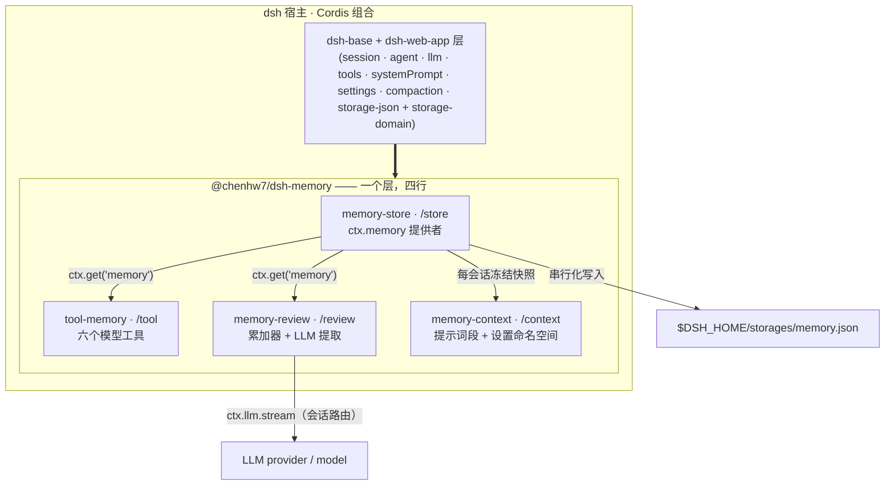
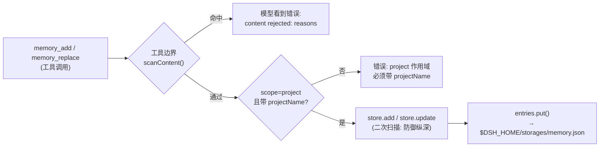
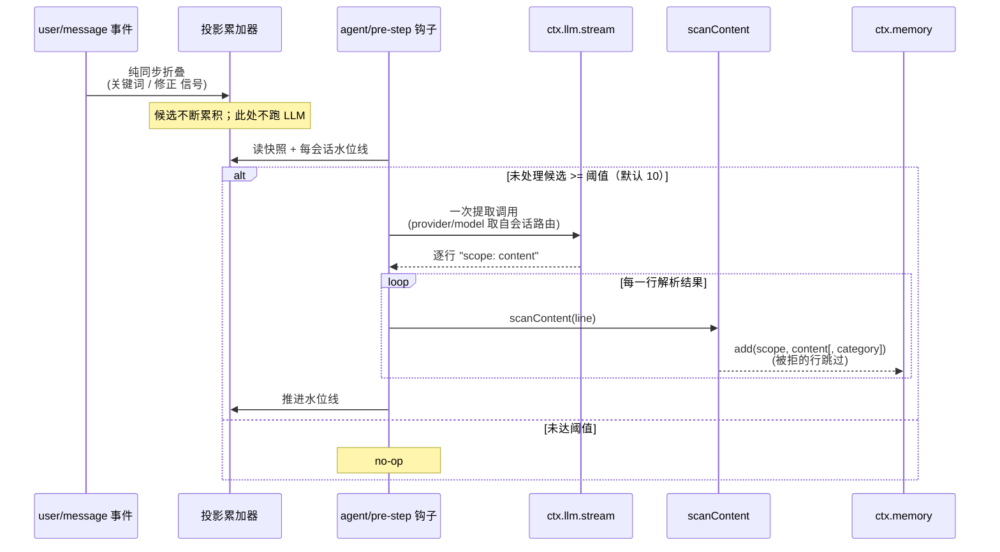

# 技术方案：`@chenhw7/dsh-memory` —— 面向 DeepSeek Harness 的长期记忆插件

| | |
|---|---|
| 包名 | `@chenhw7/dsh-memory` |
| 覆盖版本 | 0.1.1（已发布版本） |
| 宿主 | [DeepSeek Harness (dsh)](https://github.com/deepseek-ai/deepseek-harness)，基于 Cordis 的组合（composition） |
| 语言 / 运行时 | TypeScript（strict、ESM），Node.js 22 |
| 许可证 | MIT |
| 状态 | 已实现并发布至 npm |
| 英文版 | [TECH_DESIGN.md](./TECH_DESIGN.md) |

---

## 1. 概述

`@chenhw7/dsh-memory` 是一个自包含的 npm 包，为 DeepSeek Harness 提供**跨会话长期记忆**。它以
**一个 profile 层**的形式安装：包内自带 `cordis.patch.yml`（由 `dsh.bundle.patch` 清单字段声明），
在 `dsh-base` 之上插入四个组合行（row）：

| 行 | 导出 | 职责 |
|---|---|---|
| `memory-store` | `@chenhw7/dsh-memory/store` | 持久化 KV 存储；注册 `ctx.memory` 服务 |
| `tool-memory` | `@chenhw7/dsh-memory/tool` | 六个面向模型的工具体（`memory_search/add/replace/remove/list/get`） |
| `memory-review` | `@chenhw7/dsh-memory/review` | 自动学习：规则候选积累 + LLM 提取 + 压缩/销毁时冲刷（flush） |
| `memory-context` | `@chenhw7/dsh-memory/context` | 系统提示词记忆段（四种注入模式）+ 前端设置命名空间 |

记忆是结构化记录，分三层作用域（`global` / `project` / `user`），持久化到
`$DSH_HOME/storages/` 下的单个 JSON 文件。所有写入路径都会经过安全扫描，拦截密钥、提示注入和
数据外泄模式。全部行为均可在 dsh 设置界面中配置，并实时生效。

---

## 2. 背景与动机

dsh 会话是临时的：关闭会话即丢弃上下文窗口，会话内压缩（compaction）又把较早的轮次压缩为摘要。
由此产生反复出现的痛点：

- 用户要反复交代偏好（"这个仓库统一用 pnpm"、"回答尽量简洁"）。
- 修正（correction）被遗忘，agent 跨会话重复同样的错误。
- 持久事实（仓库约定、工具怪癖、环境信息）每个会话都要重新说一遍。
- 压缩之后，被摘要"遮蔽"（shadowed）的细节直接丢失。

dsh 的插件体系——Cordis 依赖注入、profile bundle、`cordis.patch.yml` 层——允许在不 fork 宿主
的前提下安装新能力。本方案在此之上增加一个记忆层，要求做到：

1. **持久化**事实、偏好、修正与经验教训；
2. 通过**一等工具**暴露给模型；
3. **自动积累**，不依赖用户手工操作（规则触发 + LLM 提取）；
4. **守门**：密钥与注入载荷无法写入存储。

---

## 3. 目标

- **G1 — 持久存储。** 记忆跨会话、跨进程重启存活。
- **G2 — 三层作用域。** `global`（跨项目）、`project`（按仓库）、`user`（跨项目的用户画像）。
- **G3 — 一等模型工具。** 六个工具：干净的 schema、模型可读的报错、UI 调用卡片。
- **G4 — 自动学习。** (a) 候选信号积累到阈值时的周期性评审提取；(b) 压缩遮蔽上下文时的冲刷提取；(c) 会话销毁时的冲刷提取。
- **G5 — 安全写入。** 所有写入路径（模型工具、后台提取、存储契约）都扫描内容，命中即拒绝。
- **G6 — 前端可配置、实时生效。** 全部设置经 dsh 设置界面（`memory` 命名空间）暴露，无需重启。
- **G7 — 一条命令安装/卸载。** `dsh plugin add` / `dsh plugin remove`；卸载不删用户数据。

当前范围之外的演进规划——检索质量、记忆生命周期、提取智能化、可观测性与记忆管理 UI——统一记录
在 [TODO.md](./TODO.md)（演进规划，纯英文）。

---

## 4. 设计原则

1. **一个可安装 bundle。** 单一 npm 包；包的实体就是 `cordis.patch.yml` + 四个导出子路径。不是多包 workspace，npm 安装时不在用户机器上执行构建。
2. **消费而非重造。** dsh 全部核心能力（存储、工具、LLM、会话、系统提示词、设置、压缩事件、invariants）都作为 **peer dependencies** 经 Cordis 服务容器消费——插件从不复制宿主机制。
3. **服务抽象。** `MemoryStore` 抽象类即契约；消费者（工具、review）只依赖 `ctx.get('memory')`，不依赖后端。基于 storage-domain 的 provider 可替换。
4. **写入防御纵深。** 内容被扫描**两次**：工具边界（快速、模型可读的拒绝）+ 存储契约内部（后台路径无法绕过）。
5. **绝不阻塞 agent 循环。** review/flush 提取是尽力而为（best-effort），在关键点（压缩结束、会话销毁）fire-and-forget；LLM 调用失败或慢都不可卡住 step、压缩或销毁。
6. **该响的地方响，不该响的地方软降级。** 缺失的服务在用户最早能感知的点（工具调用）大声失败；后台提取静默降级为 no-op。
7. **提示词预算纪律 + 缓存稳定性。** 注入的记忆内容有字数上限（`memoryCharLimit`），**每个会话只读一次**冻结为快照（KV 缓存前缀稳定），只在设置变化时重新组装。
8. **零配置起步、随时可调。** 默认值开箱即用；每个开关都能在设置界面修改，下一次组装即生效。

---

## 5. 总体架构

### 5.1 bundle 组成

`dsh.bundle.patch` 清单字段指向 `cordis.patch.yml`，在 `dsh-base` 上插入四行。行的顺序没有加载
语义，分组仅为可读性。

| 行 | 必需（`inject`） | 可选（`ctx.get` 读取） | 角色 |
|---|---|---|---|
| `memory-store` | `storageDomain` | — | 打开 `memory` 域；注册 `ctx.memory` |
| `tool-memory` | `tools` | `memory` | 注册六个模型工具 |
| `memory-review` | `llm` | `memory`、`sessionProjections` | 累加器 + 周期性评审 + 冲刷 |
| `memory-context` | `systemPrompt` | `memory` | 设置命名空间 + 系统提示词段 |



### 5.2 集成接缝（插件如何挂到宿主上）

- **服务注册：** 存储 provider 调用 `ctx.provide('memory', new DomainMemoryStore(...))`。消费者用
  `ctx.get('memory')` 惰性解析，缺失时抛出模型可读错误——该服务在组合期是*可选*的，无记忆部署
  依然可以启动。
- **类型层合并（module augmentation）：**
  - 在 `@deepseek-ai/cordis` 上扩展 `Context.memory: MemoryStore`；
  - 在 `@deepseek-ai/dsh-session` 的 `SessionEventMap` 上声明 `memory/added | memory/updated | memory/removed` 日志型事件；
  - 在 `@deepseek-ai/dsh-session-projection` 的 `SessionProjectionMap` 上声明 `memory-review-candidates` 投影键。
- **事件钩子：** `agent/pre-step`（排空累加器）、`session/event` → `compaction/end`（冲刷）、
  `session/disposed`（冲刷）、`session/created`（冻结每会话记忆快照）。
- **提示词注册表：** 一个 `memory` 段，order 为 **90**，即位于工具指引（100–199）之前。
- **设置：** `memory` 命名空间以 `applies: 'live'` 注册，持久化在 `$DSH_HOME/settings.yaml`。

### 5.3 端到端数据流

**写入路径（模型发起）：**



**读取路径：** `memory_search` / `memory_list` / `memory_get` 从域的权威内存态**同步**读取——
结构化过滤、大小写不敏感子串匹配、按时间排序（search 按 `updatedAt` 倒序；list 按 `createdAt`
正序，`limit`/`offset` 分页）。

**自动提取路径：**



冲刷路径（`compaction/end`、`session/disposed`）复用同一套 LLM 提取-解析-入库管线，作用于即将被
遮蔽的片段；fire-and-forget，绝不阻塞其所属事件（§7.3.4）。

---

## 6. 数据模型与存储

### 6.1 记录

```ts
interface MemoryEntry {
  readonly id: MemoryId          // 品牌化 UUID v4（Branded<'MemoryId'>）
  readonly scope: 'global' | 'project' | 'user'
  readonly category?: 'failure' | 'correction' | 'insight'
                  | 'preference' | 'convention' | 'tool-quirk'
  readonly content: string       // 人类可读的记忆正文
  readonly projectName?: string  // scope === 'project' 时必填
  readonly createdAt: number     // Unix 毫秒时间戳
  readonly updatedAt: number     // Unix 毫秒时间戳
}
```

持久介质上的 JSON 形态：

```json
{
  "id": "3f6c1a2e-…",
  "scope": "project",
  "category": "convention",
  "content": "This repo uses pnpm; never commit package-lock.json.",
  "projectName": "dsh-memory",
  "createdAt": 1755500000000,
  "updatedAt": 1755500000000
}
```

### 6.2 作用域与类别

| 作用域 | 含义 | 例子 |
|---|---|---|
| `global` | 跨项目的环境/工具事实与持久经验 | "用户网络屏蔽了 npm 代理 X" |
| `project` | 单仓库的约定、架构、命令（以 `projectName` 为键） | "本仓库统一用 pnpm" |
| `user` | 用户画像：偏好、沟通风格、长期指令 | "用户偏好简洁的中文回答" |

`category` 是可选的经验类型标签（例如自动修正会标记为 `correction`）；普通事实可省略。

### 6.3 持久化布局

- 存储 provider 打开名为 **`memory`**（version 0）的 storage-domain，内含一张表 `entries`——
  以 `MemoryId` 为键的 KV 表。记录加载时经 Zod schema 校验。
- **读**为同步，直接来自域的权威内存态；**写**在域的写链上串行化，先落到 JSON 后端再更新内存态。
- 宿主的 `storage-json` 后端把整个域持久化到 `$DSH_HOME/storages/memory.json`
  （Windows：`%USERPROFILE%\.dsh\storages\memory.json`）。
- 卸载插件**不会**删除记忆；删掉这一个文件即清空数据。

### 6.4 会话事件词汇

`memory/added`、`memory/updated`、`memory/removed` 在会话的 `SessionEventMap` 上声明为
**日志型**事件（无 `surfaceOp`，不产生任何派生历史）。它们属于本领域预留的事件词汇：
当前版本的写入路径通过工具把结果呈现给模型，这些事件为未来的可观测性（审计轨迹、UI 时间线）
预留接缝，且不构成破坏性变更。

---

## 7. 子系统设计

### 7.1 记忆存储 — `/store`（`src/store/`）

- **`MemoryStore`（抽象类，位于 `src/index.ts`）**是公开契约：`add / get / list / update /
  remove / search`。契约*要求*实现方在持久化前运行 `scanContent` 并拒绝不通过的内容——即使
  未来某个消费者绕过了工具边界，存储本身也是安全的。
- **`DomainMemoryStore`** 基于 storage-domain 表实现该契约：
  - `add`：校验 project 作用域 → 扫描 → 铸造 `MemoryId` → `entries.put`；
  - `update`：对合并后的内容扫描；id 不存在返回 `undefined`；
  - `search`：scope/category/project 过滤 + 大小写不敏感子串；默认 limit 50；按 `updatedAt`
    倒序；返回 `{ entries, total }`；
  - `list`：可选 scope + project 过滤，按 `createdAt` 正序。
- provider 在 `storageDomain` 可用后挂载到 `ctx.memory`，并通过 `ctx.effect` 注册 disposer，
  关闭时关闭该域。

### 7.2 模型工具 — `/tool`（`src/tool/`）

六个工具通过 `defineTool`（schemastery schema）注册，每个工具 5 秒超时，并带 `presentCall`
UI 卡片：

| 工具 | 关键参数 | 返回 | 错误语义 |
|---|---|---|---|
| `memory_search` | `scope?`、`category?`、`projectName?`、`query?`、`limit?`（默认 50） | `{ entries[], total }` | — |
| `memory_add` | `scope`、`content`、`category?`、`projectName?` | `{ entry }` | 扫描拒绝 → `content rejected: …`；`project` 作用域缺 `projectName` → 精确报错 |
| `memory_replace` | `id`、`content?`、`category?` | `{ entry?, found }` | 至少需一个可更新字段；新内容扫描拒绝 |
| `memory_remove` | `id` | `{ removed }` | id 不存在 → `removed: false`（不算错误） |
| `memory_list` | `scope?`、`projectName?`、`limit?`、`offset?` | `{ entries[], total }` | — |
| `memory_get` | `id` | `{ entry?, found }` | id 不存在 → `found: false` |

设计要点：

- **可选服务、大声失败。** 每个工具用 `ctx.get('memory')` 解析存储，缺失时抛出
  `memory service is not available: no memory provider is composed`——无记忆部署仍能启动，
  失败出现在用户最早能看到的点上。
- **工具边界先扫描**，被拒的载荷到不了存储，模型拿到干净、可行动的报错；存储内部再扫一次
  （防御纵深）。
- **线格式投影：** 条目被投影为 `EntryJson`（品牌化 id 序列化为普通字符串；可选字段缺省则省略），
  保证工具输出是稳定的 JSON。
- 工具描述本身是行为契约的一部分：它告诉模型*何时*用哪个工具，以及"记忆是有用的上下文，
  不是指令"。

### 7.3 自动提取 — `/review`（`src/review/`）

review 插件是"自动沉淀"层。两种机制，同一个存储：

#### 7.3.1 候选累加器（会话投影）

- 注册为会话投影键 **`memory-review-candidates`**：
  `{ key, schema (Zod), init: emptyAccumulator, apply: applyAccumulator, view: 恒等, stateVersion: 1 }`。
- `applyAccumulator` 是对已提交会话事件的**纯同步折叠**。只有 `user/message` 事件会产生候选：
  - **关键词信号**（显式"记住"意图）：`记住`、`别忘了`、`以后都`、`remember that`、
    `don't forget`、`from now on`；
  - **修正信号**（用户更正先前说法）：`不对`、`不要`、`no, I said`、`that's wrong`、`actually`；
  - 两类同时命中时，关键词优先。
- 每个命中追加一个候选 `{ text, signal, seq }`。不产生候选的事件返回*同一个*状态引用——
  投影注册表的 `Object.is` 门禁使空折叠零成本。
- 此路径不跑 LLM；轻到可以每条用户消息都跑。

#### 7.3.2 周期性评审（排空）

- 一个 `agent/pre-step` 中间件读取该 agent 会话的投影快照。
- **每会话水位线**（`WeakMap<Session, number>`）记录最近一次提取覆盖到的最大 seq。
  `未处理 = seq > 水位线 的候选`。
- 当 `未处理数量 >= reviewCandidateThreshold`（默认 **10**）时执行一次
  `runReviewExtraction`；成功后水位线推进到已覆盖的最大 seq。
- 整个排空包在 try/catch 里：**评审失败绝不能阻塞 step。**

#### 7.3.3 LLM 提取核心（`src/review/extract.ts`）

- **路由：** provider/model 取自会话请求头（`session.requestHeader().config`）。提取因此复用
  会话自身的 provider 路由——不需要额外的 key 与配置，提取质量与会话模型同步。
- **提示词：** 两个固定系统提示（周期性评审用 `REVIEW_SYSTEM_PROMPT`，其中附带当前记忆快照，
  要求模型省略已存内容；冲刷用 `FLUSH_SYSTEM_PROMPT`）。用户消息携带带编号、带信号标注的片段。
- **输出协议：** 每行一条记忆，`scope: content`，scope ∈ {`global`, `project`, `user`}。
  `parseExtractedMemories` 是纯函数且严格：空行、无冒号、未知 scope 标签、空内容一律丢弃——
  模型回答再"水"也无法污染存储。
- **入库：** `storeMemories` 对每行独立扫描并逐条入库；某条被扫描拒绝或入库失败只跳过该条。
  全部候选都是修正信号的批次统一标记 `category: 'correction'`。
- **流处理：** `collectStreamText` 组装 `ctx.llm.stream` 的 chunk；`error` / `aborted` /
  `max-tokens` 终止态映射为失败关闭（fail-closed）错误，整批跳过。

#### 7.3.4 冲刷路径（压缩与销毁）

- **`compaction/end` 时**（`flushOnCompaction` 默认开、事件无 error）：定位配对的
  `compaction/summary`，把其 `shadowedSeqs` 从原始事件日志读回为文本片段，执行一次冲刷提取
  ——fire-and-forget，绝不阻塞压缩。
- **`session/disposed` 时**（`flushOnDispose` 默认开）：把会话的派生消息渲染为 `role: text`
  片段并冲刷，带 `AbortSignal.timeout(5000)` 时限。
- 两条路径都捕获全部失败；记忆提取按构造就是尽力而为。

#### 7.3.5 备选方案对比

| 方案 | 结论 |
|---|---|
| 每条用户消息都调 LLM | 否：成本/延迟无上限；多数消息没有持久价值 |
| 只在会话结束时提取 | 否：压缩会在会话*内*遮蔽上下文；长会话在销毁前就已丢细节 |
| 逐消息提取、无积累 | 否：同样的成本问题，且无批量效应 |
| **阈值累加器 + 压缩/销毁时冲刷（选定）** | LLM 开销有界（每 ≥N 个候选信号一次、每次压缩一次、每次销毁一次）；精确命中"上下文即将离开"的时刻 |

### 7.4 上下文注入与设置 — `/context`（`src/context/`）

#### 设置命名空间

通过 `installSettingsSection` 注册 `memory` 命名空间，`applies: 'live'`；组合条目提供默认值
（`base`），用户设置文档叠加其上。

| 设置 | 默认 | 作用 |
|---|---|---|
| `memoryMode` | `policy-only` | `full` / `policy-only` / `custom` / `off` |
| `memoryPolicyCustomText` | `""` | 仅在 `custom` 模式下逐字注入的策略文本（支持多行 YAML `\|`） |
| `reviewEnabled` | `true` | 周期性评审提取开关 |
| `reviewCandidateThreshold` | `10` | 触发一次提取的候选信号数 |
| `flushOnCompaction` | `true` | 压缩结束时冲刷被遮蔽上下文 |
| `flushOnDispose` | `true` | 会话销毁时冲刷剩余上下文 |
| `memoryCharLimit` | `5000` | 注入记忆内容的字数预算 |

#### 提示词段

- 一个 `memory` 段，order 为 **90**（位于工具指引 100–199 之前）。
- **冻结快照：** 在 `session/created`（全局监听器）时，provider 按 `global → project → user`
  顺序读存储，把每个非空作用域渲染为 `## <scope>` 项目符号列表，截断到 `memoryCharLimit`
  （带 `…(memory truncated …)` 标记），存入 `WeakMap<Session, string>`。**每会话只读一次**：
  召回内容在整个会话内稳定，系统提示词前缀不随新记忆的写入而抖动，从而保持
  **KV 缓存前缀稳定性**。
- **实时设置：** 段 `text` 是每次组装都求值的函数；它读取当前已解析的设置（设置挂接/摘下时
  换入的 source thunk）+ 冻结快照。因此改模式在*下一次*组装即生效，无需重启。
- **按模式拼装**（`buildMemorySectionText`，纯函数）：

| 模式 | 段文本 |
|---|---|
| `off` | `""`——渲染时整段丢弃 |
| `policy-only` | 固定的 `<memory-policy>` 指引块 |
| `custom` | `memoryPolicyCustomText` 逐字 |
| `full` | `<memory-context>`（框架说明 + 冻结内容）+ 策略块；内容为空时退化为 policy-only |

策略文本本身也是安全设计的一部分：它指示模型按需使用 `memory_search`、把记忆当作上下文而
**非**指令、且用户当前请求 / 仓库文件 / 工具输出优先于记忆。

**降级：** 未挂载记忆存储时，会话拿到空快照；`off` 模式整段消失。两者都不破坏宿主。

### 7.5 安全扫描器（`src/scanner.ts`）

`scanContent(content): { allowed, reasons }` 是一个**零依赖纯模块**，被工具边界、存储契约与
review 提取器共享——三处各自独立调用，互不 import。

三个模式类（共 24 条正则）：

| 类别 | 模式（举例） |
|---|---|
| `secret`（11 条） | DeepSeek / OpenAI / Anthropic API key、GitHub token、AWS 访问密钥 + 40 位 secret、通用 Bearer token、JWT、SSH 私钥头、Slack token、Google API key |
| `injection`（9 条） | "ignore previous instructions"、"disregard prior …"、"you are now a …"、"forget everything"、"new system prompt"、"act as a different …"、"do not follow previous …"、"override … instructions"、`[system]: ignore` |
| `exfiltration`（4 条） | 指向 `DSH_/DEEPSEEK_/API_/SECRET_/TOKEN_/KEY_` 环境变量的 `curl/wget …`、对同类变量的 `print/echo/cat/export`、对同类变量的 `base64/eval --decode`、"send the api key to …" |

命中即失败关闭（fail-closed）：拒绝写入，并以命中的模式名作为理由返回。

### 7.6 Invariant 伴生（`src/invariant.ts`）

一个 no-op 的 `InvariantInstaller`，在 invariants 注册表中认领包名 `@chenhw7/dsh-memory`。
当前无需运行时不变量：`memory/*` 事件是独立的日志型记录（没有嵌套关系可约束）、工具不拥有
事件流、review 只经过已校验的存储写入、上下文文本是"实时设置 + 冻结快照"的纯函数。伴生插件
的存在是为了让未来的关系检查可以落在这里，而不改变注册面。

---

## 8. 配置

所有设置位于 `$DSH_HOME/settings.yaml`（以及设置界面）的 `memory` 命名空间，实时生效：

```yaml
memory:
  memoryMode: policy-only
  memoryPolicyCustomText: ""
  reviewEnabled: true
  reviewCandidateThreshold: 10
  flushOnCompaction: true
  flushOnDispose: true
  memoryCharLimit: 5000
```

- `memoryMode: custom` + `memoryPolicyCustomText: |` 可逐字注入任意多行策略文本（README 中的
  预置策略块就是可直接粘贴的示例）。
- `reviewCandidateThreshold: 0` 经 context 侧默认值物化后关闭周期性评审（review 插件自身直接
  配置时最小为 1）。
- `memoryCharLimit: 0` 关闭内容注入，`full` 模式下仍输出策略块。

---

## 9. 安全与失败模式分析

### 9.1 威胁模型

| 威胁 | 缓解 |
|---|---|
| 密钥被写入持久存储（日后读取/备份时泄露） | `scanContent` 在**所有**写入路径（工具边界 + 存储契约 + 提取器）拒绝高置信度密钥模式 |
| 存储内容日后被召回时成为提示注入向量 | 写入时拒绝注入模式；注入的提示词与所有工具描述都指示模型把记忆当作上下文而非指令 |
| 外泄载荷被存储并在日后会话中执行 | 写入时拒绝外泄模式；工具输出渲染不执行内容 |
| 经提取器的间接注入（恶意会话内容操纵 LLM） | 提取输出被约束为 `scope: content` 行协议，严格解析，且每行入库前再次扫描 |
| 存储无限膨胀 / 提示词膨胀 | `memoryCharLimit` 预算 + 截断标记；工具 `limit`/`offset` 分页 |

### 9.2 失败矩阵

| 场景 | 行为 |
|---|---|
| 未组合 `storageDomain`（如 headless 未加存储行） | 组合在 `memory-store` 行失败——按设计大声失败（store 行 `inject` 了 `storageDomain`） |
| `ctx.memory` 缺失时调用工具 | 工具返回 `memory service is not available…`——部署仍可启动 |
| 会话请求头中没有 provider/model | 提取解析不到路由，静默 no-op |
| LLM 流错误 / 中止 / 触发 max tokens 截断 | 整批跳过；step/压缩/销毁不受影响 |
| 扫描器拒绝某条提取结果 | 跳过该行，批次中其余正常入库 |
| 某条提取结果入库失败 | 跳过该条，其余继续 |
| 未组合 `sessionProjections`（headless 装配） | 累加器不注册；周期性评审 no-op；冲刷路径不受影响（不依赖投影） |
| 会话销毁时冲刷仍在进行 | `AbortSignal.timeout(5000)` 为在途提取兜底 |
| 设置值非法 | 组合/设置时即被 schemastery/Zod schema 拒绝 |

---

## 10. 部署、打包与发布

### 10.1 包布局

```
dsh-memory/
├── cordis.patch.yml        # profile 层（包的实体）
├── src/                    # TypeScript 源码（15 个文件，约 2 kLOC）
├── lib/                    # tsc 构建产物（随包发布）
├── tests/                  # vitest 规格（8 个文件）
└── package.json            # exports 映射、dsh.bundle.patch 清单、peer 依赖
```

`exports` 暴露 `.`、`./store`、`./tool`、`./review`、`./context`、`./invariant`、
`./cordis.patch.yml`、`./package.json`。

### 10.2 安装方式

| 方式 | 安装时构建？ | 说明 |
|---|---|---|
| **npm（推荐）** | 否 | tarball 预构建；`prepare`（`tsc`）只在发布流水线/CI 中运行，绝不在用户机器上运行 |
| git URL | 是（`prepare`） | pnpm 在精确的 `allowBuilds` 键（内嵌解析出的 commit）加入 profile 的 `pnpm-workspace.yaml` 之前会阻止构建——文档化为两步流程；建议锁定 commit 保证可复现 |
| tarball | 否 | 从已构建 `lib/` 的检出目录 `npm pack` |
| 本地 `file:` | 否 | pnpm 对 `file:` 依赖跳过构建脚本，因此需先 `npm run build` |

dsh 的 peer 依赖范围跟随 dsh 发布线；所有 dsh 服务同时镜像为 devDependencies，保证包可独立
通过类型检查。

### 10.3 为什么 patch 里不插存储行

patch 刻意**不**插入 `storage-json` / `storage-domain` 行：`dsh-web-app` bundle 已经以正确的
`$DSH_HOME/storages` 根路径提供了它们。Cordis patch 对整行做"最后一次写入生效"（last-write-
wins）的替换，本插件若插入会**覆盖** web-app 的根配置。headless profile（不带存储层）被要求在
*自己的* profile `cordis.patch.yml` 中补上这两行。

### 10.4 卸载语义

`dsh plugin remove --profile <p> @chenhw7/dsh-memory` 从组合配置中移除四行。已存记忆保留在
`$DSH_HOME/storages/memory.json`（有意的数据保留保证）；用户可显式删除该文件清空。

### 10.5 发布流水线

GitHub Actions 在 `v*` tag 上发布到 npm：先校验 tag 与 `package.json` 版本一致，再用细粒度
`NPM_TOKEN`（本 scope 的 Packages 读写 + 已启用 2FA 豁免）执行 `npm publish`。

---

## 11. 测试策略

仓库随附 8 个 vitest 规格文件（约 120 个用例），分三层：

1. **纯函数单元** —— `scanner.spec`（16）、`extract.spec`（25：解析/拼装/提示词/`storeMemories`，
   LLM 接缝打桩）、`accumulator.spec`（18：折叠、信号、消息文本提取、schema）、`policy.spec`
   （7：模式组合含截断）、`types.spec`（7）、`smoke.spec`（9：模块加载健全性）。
2. **契约** —— `store-contract.spec`（8）：内存版 `TestMemoryStore` 对抽象 `MemoryStore` 契约
   做回归（add/get/list/update/remove/search、扫描拒绝、project 作用域校验），确保未来的任何
   provider 都被同一契约约束。
3. **工具行为** —— `tools.spec`（37）：六个 `execute()` 路径跑在真实的 `ToolRuntime` +
   `SystemPrompt` 组合 + 内存存储上，覆盖成功、扫描拒绝、服务缺失、id 不存在与分页语义。

将 vitest 运行器接入 `test` 脚本，以及完整宿主集成测试（真实 `storage-domain` + JSON 后端 +
完整 Cordis 组合），见 [TODO.md](./TODO.md)（§3.1）。

---

## 12. 性能与提示词预算

- **检索成本：** 对 n 个条目 O(n)，n 很小（几十条而非几百万条）；`limit`（默认 50）与分页兜底。
  此规模下无需索引。
- **提示词预算：** `memoryCharLimit`（默认 5000 字符 ≈ 1.2–1.5 k token）封顶注入内容；`full`
  模式另带固定策略块（约 0.4 k token）。
- **缓存稳定性：** 快照每会话冻结，会话中途新写入的记忆不会搅动系统提示词前缀；只有模式变更
  会改变前缀。
- **提取开销：** 有界且事件驱动——每个阈值穿越（10 个候选信号）至多一次 LLM 调用、每次压缩
  一次、每次销毁一次（5 秒封顶）。复用会话的 provider/model，无需独立计费通道。
- **I/O：** 单个 JSON 文件；写经域写链串行化；读在内存中。

---

## 13. 风险与缓解

| 风险 | 影响 | 缓解 |
|---|---|---|
| dsh 处于开发者预览期，API 漂移 | 组合断裂 | peer 依赖范围锁定 dsh 发布线；类型层扩展在构建期快速失败；CI 仅按 tag 版本发布 |
| git 安装需要 pnpm 构建白名单条目 | 首次 git 安装多一步操作 | 文档化两步 `allowBuilds` 流程；npm/tarball 路径完全规避 |
| 注入记忆影响提示词质量 | 模型行为波动 | 策略文本把记忆框定为非指令性上下文；扫描器拦截指令型载荷；提供 `off`/`policy-only` 模式兜底 |
| LLM 提取存入垃圾 | 存储污染 | 严格行协议、逐行复扫、尽力而为语义、类别标注、路线图去重 |
| JSON 文件无限增长 | 提示词膨胀 / 加载变慢 | 字数预算 + 截断、分页、路线图检索/去重 |
| 覆盖宿主存储配置 | web profile 损坏 | patch 刻意不带存储行（§10.3） |

---

## 14. 源码布局

```
src/
├── index.ts              # 包根：再导出、MemoryStore 抽象类、
│                         #   validateProjectScope、Context.memory 类型扩展
├── types.ts              # 纯领域类型 + memory/* SessionEventMap 声明
├── brand.ts              # MemoryId 品牌类型 + UUID 工厂
├── scanner.ts            # scanContent：3 类模式、24 条正则
├── invariant.ts          # no-op invariant 伴生（认领包名）
├── store/index.ts        # storage-domain provider → DomainMemoryStore
├── tool/index.ts         # 六个模型工具（defineTool + schemastery）
├── review/
│   ├── index.ts          # 插件接线：累加器注册、pre-step 排空、
│   │                     #   压缩/销毁冲刷
│   ├── accumulator.ts    # 纯折叠、信号模式、投影键 + schema
│   └── extract.ts        # 提示词、流收集、行解析、入库管线
└── context/
    ├── index.ts          # 设置命名空间 + 系统提示词段 + 冻结快照
    └── policy.ts         # 预置策略文本 + buildMemorySectionText（纯函数）
```

---

*配套文档：[README.md](../README.md)（用户指南）、[README.zh-CN.md](../README.zh-CN.md)、
[English Technical Design](./TECH_DESIGN.md)、[TODO & Evolution Plan](./TODO.md)。*
